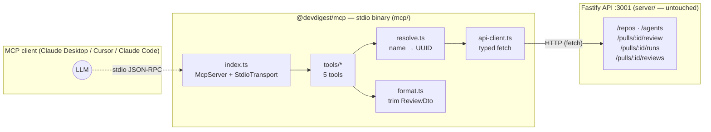

# Development Plan — `@devdigest/mcp` Server (Lesson L04)

## TL;DR

Build a standalone local MCP server (`mcp/`, package `@devdigest/mcp`) that gives any MCP
client (Claude Desktop, Cursor, Claude Code) five DevDigest tools over stdio transport. The
server is a thin adapter: MCP tool calls come in over JSON-RPC, the server resolves friendly
names to UUIDs by calling the running Fastify API at `http://localhost:3001`, triggers or
reads reviews, and returns compact trimmed JSON back to the LLM. No direct DB access, no
server imports, no new server routes. `server/` is read-only throughout.

---

## 1. Goal and Context

Build a package `mcp/` that exposes five DevDigest tools over the official MCP TypeScript SDK
(`@modelcontextprotocol/sdk` 1.29.0) using **stdio** transport, so a local MCP client can:

- List configured reviewer agents.
- Run one agent on a PR and receive the verdict and findings synchronously (poll-based).
- Read the latest review session for a PR without triggering a new run.
- Call stub tools for conventions and blast-radius that return `not_implemented` cleanly.

The server reaches data **only by HTTP-calling the running Fastify API** at
`http://localhost:3001` (configurable). There is no direct DB access and no importing of
server internals. `get_conventions` and `get_blast_radius` ship as minimal `not_implemented`
stubs (Blast Radius is later homework). `server/` stays entirely untouched.

---

## 2. Affected Packages and Modules

| Package | Role | Changes |
|---|---|---|
| `mcp/` (new) | The adapter/client being built | All new files — sole target of this plan |
| `server/` | Fastify API consumed over HTTP | Read-only; zero edits, zero new routes, zero migrations |
| `client/` | React frontend | None |
| `e2e/` | Automated end-to-end tests | None (manual MCP Inspector verification only) |

This plan has no UI tasks. Section 6 is intentionally empty.

---

## 3. Architecture and Component Boundary

The MCP server is a thin **adapter/client** layer — not a service with business logic. It
translates MCP tool calls into sequences of HTTP requests against the existing Fastify API,
trims the responses to a concise shape, and returns a single compact text block to the LLM.



### Key architectural decisions

- **Self-contained package** — no `@devdigest/shared` alias, no re-vendoring of
  `server/src/vendor/shared/`. Only the ~5 fields per API call are declared as local
  interfaces. This avoids a third drifting copy of the shared contracts
  (`server/INSIGHTS.md:20`).
- **Emitting binary** — unlike `reviewer-core` (which uses `noEmit: true` because it is
  consumed as source), `mcp/` is a runnable binary. Its tsconfig must emit to `dist/` with
  a `#!/usr/bin/env node` shebang so MCP clients can launch it with `node dist/index.js`.
- **HTTP-only data access** — the hard boundary between `mcp/` and `server/` is the Fastify
  HTTP API. No TypeScript imports across the package boundary.
- **stdout is sacred** — over stdio transport, any `console.log` corrupts the JSON-RPC
  channel. All diagnostics must go to `stderr`.

---

## 4. Key Constraints (from Codebase Grounding)

These constraints shape every task below. They were verified against server source.

| Constraint | Evidence |
|---|---|
| Not a monorepo workspace — each package owns its own `package.json`/lockfile/tsconfig | Root `CLAUDE.md`; `server/INSIGHTS.md:20` |
| Shared contracts hand-vendored, not auto-synced — adding a third copy would create drift | `server/INSIGHTS.md:20` |
| `reviewer-core/tsconfig.json` uses `noEmit: true` — the MCP package flips this | `reviewer-core/tsconfig.json:18` |
| `POST /pulls/:id/review` is fire-and-forget — `reviews` in the response is **always `[]`** | `server/src/modules/reviews/service.ts:131-138` |
| The route is rate-limited to 10 req/min | `server/src/modules/reviews/routes.ts:29` |
| No auth locally — `getContext` always resolves via `LocalNoAuthProvider` | `server/src/adapters/auth/local.ts` |
| Batch window for "latest session" = 120,000 ms (`BATCH_WINDOW_MS`) | `server/src/modules/pulls/routes.ts:127` |
| Filter reviews by `kind === 'review'` to exclude `summary` rows | `server/src/modules/pulls/routes.ts:145` |
| `PrMeta.id` is `.nullish()` — must guard before use | `server/src/vendor/shared/contracts/platform.ts:164` |
| Error envelope shape: `{ error: { code, message } }` | `server/src/platform/errors.ts:4` |

---

## 5. Backend Tasks

> All tasks live under `mcp/` (new package). Tag legend: **OA** = onion-architecture,
> **TS** = typescript-expert, **ZOD** = zod, **SEC** = security, **ACR** = api-contract-review.

### T-B1 — Package Scaffold

**Files to create:** `mcp/package.json`, `mcp/tsconfig.json`, `mcp/.env.example`,
`mcp/.gitignore`, `mcp/README.md`

**`package.json` shape:**
```jsonc
{
  "name": "@devdigest/mcp",
  "private": true,
  "type": "module",
  "bin": { "devdigest-mcp": "dist/index.js" },
  "scripts": {
    "dev":       "tsx watch src/index.ts",
    "build":     "tsc -p tsconfig.json",
    "start":     "node dist/index.js",
    "typecheck": "tsc --noEmit -p tsconfig.json"
  },
  "dependencies": {
    "@modelcontextprotocol/sdk": "1.29.0",
    "zod": "^3.24.1"
  },
  "devDependencies": {
    "@types/node": "^22",
    "tsx": "^4.19",
    "typescript": "^5.7"
  }
}
```

**`tsconfig.json`:** copy `reviewer-core/tsconfig.json` compiler options (verified at
`reviewer-core/tsconfig.json:1-29`) but override:
- `"noEmit": false`
- `"outDir": "dist"`
- `"rootDir": "src"`
- `"types": ["node"]`
- Remove `paths` aliases — no `@devdigest/shared` in this package.

**`.env.example`:**
```
DEVDIGEST_API_URL=http://localhost:3001
DEVDIGEST_MCP_TIMEOUT_MS=120000
```

**`.gitignore`:** `dist/`, `node_modules/`, `.env`

**Skills:** TS, OA, SEC

**Done when:** `install && build` produces `dist/index.js`; `typecheck` passes after later
tasks land.

---

### T-B2 — Config Loader (`src/config.ts`)

Parse environment variables with Zod; fail fast on invalid config.

**Interface:**
```typescript
loadConfig(): { apiBaseUrl: string; timeoutMs: number }
```

**Zod schema:**
- `DEVDIGEST_API_URL` → `z.string().url().default('http://localhost:3001')`
- `DEVDIGEST_MCP_TIMEOUT_MS` → `z.coerce.number().int().positive().default(120000)`

On `safeParse` failure: write flattened error to `stderr` and `process.exit(1)`.

**Skills:** ZOD, TS, SEC

**Done when:** returns defaults with no env set; a bad URL exits non-zero with a stderr
message.

---

### T-B3 — Typed HTTP Client (`src/api-client.ts`)

Thin wrapper over native `fetch` (Node ≥ 22). `baseUrl` from config.

**Private helpers:** `get<T>(path): Promise<T>` and `post<T>(path, body): Promise<T>` — parse
JSON; on non-2xx throw `ApiHttpError { status, code, message }` extracted from
`{ error: { code, message } }` (`server/src/platform/errors.ts:4`); on network failure
(connection refused) throw `ApiUnreachableError`.

**Typed methods (local minimal interfaces only — no shared contracts vendored):**

| Method | Endpoint | Return shape |
|---|---|---|
| `listRepos()` | `GET /repos` | `{ id, owner, name, full_name }[]` |
| `listPulls(repoId)` | `GET /repos/:id/pulls` | `{ id, number, title }[]` |
| `listAgents()` | `GET /agents` (`server/src/modules/agents/routes.ts:74`) | `{ id, name, model, provider, enabled }[]` |
| `triggerReview(prId, agentId)` | `POST /pulls/:id/review` | `{ runs: { run_id, agent_id, agent_name }[] }` |
| `listRuns(prId)` | `GET /pulls/:id/runs` (`server/src/modules/reviews/routes.ts:101`) | `{ run_id, status, error, findings_count, score, ran_at }[]` |
| `listReviews(prId)` | `GET /pulls/:id/reviews` (`server/src/modules/reviews/routes.ts:129`) | `ReviewDtoLocal[]` |

**`ReviewDtoLocal`** (local, trimmed from `server/src/modules/reviews/helpers.ts:18-32`):
```typescript
interface ReviewDtoLocal {
  id: string;
  run_id: string | null;
  agent_name: string | null;
  kind: 'summary' | 'review';
  verdict: string | null;
  score: number | null;
  created_at: string;
  findings: FindingLocal[];
}

interface FindingLocal {
  severity: string;
  title: string;
  file: string;
  start_line: number | null;
  end_line: number | null;
  rationale: string;
  suggestion: string | null;
}
```

**Note:** `PrMeta.id` is `.nullish()` (`server/src/vendor/shared/contracts/platform.ts:164`).
The `listPulls` return type must reflect this with a null guard before passing the id to
`resolvePr`.

**Skills:** TS, OA, ACR, SEC

**Done when:** typed methods compile; non-2xx throws `ApiHttpError {status,code,message}`;
network failure throws `ApiUnreachableError`.

---

### T-B4 — Identifier Resolution and Forward-Leading Errors (`src/resolve.ts`, `src/errors.ts`)

**`src/errors.ts`:** Define `ToolError` class and forward-leading message builders:
`notFoundRepo`, `notFoundPr`, `notFoundAgent`, `apiUnreachable`, `rateLimited`.

**`src/resolve.ts`:** Three resolver functions that return a UUID on hit or throw `ToolError`
with a forward-leading message:

- **`resolveRepo(api, repo)`** — `GET /repos`; accept URL or `owner/name` slug (strip URL to
  `owner/name`); case-insensitive `full_name` match.
  - Miss → `"repo '<repo>' not found. Known repos: … — or add it in the DevDigest UI."`
  - Empty list → `"no repos imported yet. Add one in the DevDigest UI."`

- **`resolvePr(api, repoId, repoLabel, pr)`** — `GET /repos/:id/pulls`; match
  `number === pr`; guard `id != null` before returning.
  - Miss → `"PR #<pr> not found in <repoLabel>. Open PR numbers: …"`

- **`resolveAgent(api, agent)`** — `GET /agents`; case-insensitive name match.
  - Miss → `"agent '<agent>' not found — call list_agents to see valid names."`
  - Disabled agent → return and let the API decide (do not block it here).

**Skills:** TS, OA, SEC, ACR

**Done when:** resolvers return UUID on hit; `ToolError` with forward-leading text on miss;
both URL input and slug input resolve correctly for repos.

---

### T-B5 — Response Formatter (`src/format.ts`)

Trims the verbose `ReviewDtoLocal` shape down to a concise tool response. Mirrors the server's
session-window logic from `server/src/modules/pulls/routes.ts:127,145-163`.

**Functions:**

```typescript
// Trim one finding: collapse line range, drop noise fields
trimFinding(f: FindingLocal): { severity, title, file, line, rationale, suggestion? }
// line = start_line; append "-end_line" only when end_line differs from start_line

// Trim one review to the essential verdict block
trimReview(r: ReviewDtoLocal): { agent, verdict, score, findings: TrimmedFinding[] }

// Filter kind==='review', sort created_at descending, include all within 120,000 ms of newest
pickLatestSession(reviews: ReviewDtoLocal[]): ReviewDtoLocal[]

// Wrap any value as a single MCP text content block
toToolText(value: unknown): { content: [{ type: 'text'; text: string }] }
// text = JSON.stringify(value) (compact, no indent)
```

The 120,000 ms window constant mirrors `BATCH_WINDOW_MS` at
`server/src/modules/pulls/routes.ts:127`. The `kind === 'review'` filter mirrors
`server/src/modules/pulls/routes.ts:145`.

**Skills:** TS, OA, ZOD

**Done when:** fixture trims to the concise shape; multi-agent runs within 120 s collapse to
one session; `line` formatting matches the rule (no duplicate line number when start equals
end).

---

### T-B6 — MCP Bootstrap and stdout Hygiene (`src/index.ts`)

The composition root: wires config, API client, and all tools; connects over stdio.

```typescript
#!/usr/bin/env node    // must be the first line of the emitted file
```

**Steps:**
1. Call `loadConfig()`.
2. Create shared `ctx = { api: createApiClient(config.apiBaseUrl), config }`.
3. `new McpServer({ name: 'devdigest', version: '0.1.0' })` — server name acts as the
   namespace; tool names stay bare (`list_agents`, not `devdigest_list_agents`).
4. Each tool module exports `register(server, ctx)` — call all five.
5. `new StdioServerTransport()` → `await server.connect(transport)`.

**stdout hygiene (critical for stdio transport):**
- Never `console.log` — stdout is the JSON-RPC channel; any non-protocol byte corrupts it.
- All diagnostics: `console.error(...)` (stderr only).
- Top-level try/catch → stderr + `process.exit(1)`.
- `process.on('uncaughtException', ...)` and `process.on('unhandledRejection', ...)` →
  stderr.

**Token economy:** one-line description per tool, flat zod schemas, no inline examples → a
fresh chat pays only a few hundred tokens to load all five tool definitions. No
`search_tools`/code-execution mode needed for five tools.

**Skills:** TS, OA, SEC

**Done when:** binary starts, connects over stdio, registers exactly 5 tools, zero
non-protocol bytes to stdout.

---

### T-B7 — The Five Tools (`src/tools/*.ts`)

Each tool: one-line description, flat scalar Zod input schema (no nested objects), calls
`api-client`, returns one compact text block via `toToolText`. Errors are caught and returned
as a forward-leading message with `isError: true` — never throw raw errors to the MCP
framework.

#### T-B7a — `list_agents` (`src/tools/list-agents.ts`)

- **Description:** `"List configured reviewer agents (name, model, enabled). Use a returned name with run_agent_on_pr."`
- **Input:** none
- **Flow:** `api.listAgents()` → return `{ agents: [{ name, model, provider, enabled }] }`
  (cap 50 items; omit ids)

#### T-B7b — `run_agent_on_pr` (`src/tools/run-agent-on-pr.ts`)

- **Description:** `"Run one reviewer agent on a PR and wait for the verdict + findings."`
- **Input:**
  ```typescript
  repo:  z.string().min(1)             // "owner/name" or full URL
  pr:    z.coerce.number().int().positive()  // PR number
  agent: z.string().min(1)             // agent name from list_agents
  ```

```mermaid
sequenceDiagram
  participant LLM as MCP client (LLM)
  participant T as run_agent_on_pr
  participant API as Fastify API :3001

  LLM->>T: run_agent_on_pr(repo, pr, agent)
  T->>API: GET /repos
  T->>API: GET /repos/:id/pulls
  T->>API: GET /agents
  Note over T: resolve repo → PR → agent<br/>(forward-leading ToolError on any miss)
  T->>API: GET /pulls/:prId/runs  (snapshot existing run_ids)
  T->>API: POST /pulls/:prId/review { agentId }
  API-->>T: { runs:[{run_id,…}], reviews:[] }  (immediate; reviews always [])
  Note over T: capture OUR new run_id from the response
  loop every 2000 ms until terminal status or timeout (default 120 000 ms)
    T->>API: GET /pulls/:prId/runs
    API-->>T: RunSummary[]  (status: running | done | failed | cancelled)
  end
  alt status == done
    T->>API: GET /pulls/:prId/reviews
    API-->>T: ReviewDto[]
    Note over T: pick ReviewDto where run_id == ours; trim
    T-->>LLM: { verdict, score, agent, findings:[…] }
  else status == failed
    T-->>LLM: forward-leading error including run.error
  else status == cancelled
    T-->>LLM: forward-leading "cancelled — retry"
  else timeout
    T-->>LLM: "still running; call get_findings(repo, pr) shortly"
  end
```

**Polling detail:** poll `GET /pulls/:prId/runs` (not `/runs/active`) — a fast run can leave
`active` before the poll observes terminal status. Source:
`server/src/modules/reviews/routes.ts:101`.

**Special cases:**
- 429 response → `"10 reviews/min limit hit; wait and retry"` (no tight auto-retry)
- `ApiUnreachableError` → `"API not reachable at <url> — is it running? cd server && <pm> dev"`
- Timeout (default 120 000 ms via `DEVDIGEST_MCP_TIMEOUT_MS`) → `"still running after 120s; call get_findings(repo, pr) shortly"` (server-side run continues)

**Concise response shape** (drop `evidence`, `confidence`, `category`,
`trifecta_components`, ids, timestamps — grounded in
`server/src/modules/reviews/helpers.ts:12-53`):
```typescript
{
  verdict: string | null,
  score: number | null,
  agent: string,
  findings: Array<{ severity, title, file, line, rationale, suggestion? }>
}
// line = start_line; appended with "-end_line" only when they differ
```

#### T-B7c — `get_findings` (`src/tools/get-findings.ts`)

- **Description:** `"Get the latest review verdict + findings for a PR (read-only; runs nothing)."`
- **Input:** `repo: z.string().min(1)`, `pr: z.coerce.number().int().positive()`
- **Flow:** resolve → `api.listReviews(prId)` → `pickLatestSession()` → `trimReview()` per
  session member
- **Returns:**
  - Single agent: `{ verdict, score, findings: […] }`
  - Multi-agent: `{ reviews: [{ agent, verdict, score, findings: […] }] }`
  - No reviews: `"no completed review for PR #<n> yet — call run_agent_on_pr first (see list_agents)."`

#### T-B7d — `get_conventions` (`src/tools/get-conventions.ts`) — STUB

- **Description:** `"Get a repo's review conventions. (Not implemented yet.)"`
- **Input:** `repo: z.string().min(1)`
- **Flow:** NO API call.
- **Returns:**
  ```json
  {
    "status": "not_implemented",
    "message": "get_conventions is a stub in L04; the Conventions extractor lands in a later lesson."
  }
  ```

#### T-B7e — `get_blast_radius` (`src/tools/get-blast-radius.ts`) — STUB

- **Description:** `"Get the blast radius for a PR. (Not implemented yet.)"`
- **Input:** `repo: z.string().min(1)`, `pr: z.coerce.number().int().positive()`
- **Flow:** NO API call.
- **Returns:**
  ```json
  {
    "status": "not_implemented",
    "message": "get_blast_radius is a stub; Blast Radius (reads repo-intel) is L04 homework."
  }
  ```

**Shared requirement for all tools:** every handler is wrapped in try/catch; errors return
`toToolText({ error: message, isError: true })` — never propagate raw exceptions to the MCP
framework.

**Skills:** ZOD, TS, SEC, OA, ACR

**Done when:** all 5 tools register with terse one-line descriptions and flat schemas; tool
definitions cost only a few hundred tokens at connect time.

---

### T-B8 — MCP Client Wiring and Documentation (`mcp/README.md`)

The README is the complete runbook for building, registering, and running the MCP server.

**Build:**
```bash
cd mcp
npm install   # or pnpm/yarn — own lockfile
npm run build # tsc emits dist/index.js
```

**Claude Desktop / Cursor config (add to MCP client config JSON):**
```json
{
  "mcpServers": {
    "devdigest": {
      "command": "node",
      "args": ["/Users/shakhman/Documents/pet-projects/dev-digest/mcp/dist/index.js"],
      "env": {
        "DEVDIGEST_API_URL": "http://localhost:3001",
        "DEVDIGEST_MCP_TIMEOUT_MS": "120000"
      }
    }
  }
}
```

**Claude Code:**
```bash
claude mcp add devdigest -- node /Users/shakhman/Documents/pet-projects/dev-digest/mcp/dist/index.js
```

**Prerequisite:** The DevDigest API must be running (`cd server && <pm> dev`, port 3001, DB
migrated and seeded).

**Skills:** SEC, TS

**Done when:** a reader can build, register, and run the server from the README alone.

---

## 6. UI Tasks

None. This feature is entirely a new backend/tooling package.

---

## 7. Implementation Order and Parallelization

Single backend implementer owns all tasks. Strict sequence:

```
T-B1 (scaffold)
  └─ T-B2 (config)
       └─ T-B3 (api-client)
            ├─ T-B4 (resolve + errors)
            └─ T-B5 (format)
                 └─ T-B6 (index + bootstrap)
                      └─ T-B7 (5 tools)
                           └─ T-B8 (README + wiring)
```

No parallel split is needed or useful; zero edits to `server/` or `client/`.

---

## 8. Out of Scope

| Item | Notes |
|---|---|
| Blast Radius implementation | Stub stays; later homework |
| Conventions implementation | Stub stays; later lesson |
| Any `server/` change | No new route, endpoint, migration, or schema change |
| Single-run findings read | Accepted gap; 120 s session heuristic is the only available approximation |
| Auth or tokens | None needed locally |
| Non-stdio transports | Out of scope for L04 |
| `search_tools` / code-execution mode | Overkill for 5 tools |
| Automated e2e for MCP | Manual MCP Inspector verification only |
| Re-vendoring `@devdigest/shared` | Would create a third drifting copy; forbidden |
| `git commit` / `git add` | Wait for explicit user instruction (CLAUDE.md hard rule) |

---

## 9. End-to-End Verification

### Build and typecheck

```bash
cd mcp && npm install && npm run typecheck && npm run build
```

- `dist/index.js` must exist and be executable (has `#!/usr/bin/env node` shebang).
- Server tests must remain unaffected: `cd server && npm test` still green.

### MCP Inspector happy path

Prerequisites: Fastify API running on `:3001`, DB seeded.

```bash
DEVDIGEST_API_URL=http://localhost:3001 \
  npx @modelcontextprotocol/inspector \
  node /Users/shakhman/Documents/pet-projects/dev-digest/mcp/dist/index.js
```

| Check | Expected result |
|---|---|
| Tool list | Exactly 5 tools; terse one-line descriptions; flat input schemas |
| `list_agents` | Returns seeded agents by name; no UUIDs in response |
| `run_agent_on_pr("acme/payments-api", 482, "<seeded agent>")` | Polls, resolves, returns `{ verdict, score, agent, findings[] }` |
| `get_findings("acme/payments-api", 482)` | Returns same latest session |
| `get_conventions` / `get_blast_radius` | Returns `not_implemented` with zero HTTP calls |

### Negative path checks (each must return forward-leading text, not a raw error)

| Scenario | Expected message |
|---|---|
| Unknown repo | `"repo '…' not found. Known repos: …"` |
| Unknown PR | `"PR #… not found in …. Open PR numbers: …"` |
| Unknown agent | `"agent '…' not found — call list_agents to see valid names."` |
| API not running | `"API not reachable at http://localhost:3001 — is it running? cd server && <pm> dev"` |
| Rate limit hit | `"10 reviews/min limit hit; wait and retry"` |

### stdout hygiene check

```bash
node dist/index.js < /dev/null
```

Must write nothing but valid JSON-RPC to stdout. All diagnostics must appear on stderr.

---

## Files to Create

All under `mcp/` (new sibling package):

```
mcp/
  package.json
  tsconfig.json
  .env.example
  .gitignore
  README.md
  src/
    index.ts
    config.ts
    api-client.ts
    resolve.ts
    errors.ts
    format.ts
    tools/
      list-agents.ts
      run-agent-on-pr.ts
      get-findings.ts
      get-conventions.ts
      get-blast-radius.ts
```

Total: 15 files. No file outside `mcp/` is modified.

---

## Server Reference Files (Read-Only — Do Not Edit)

These files must be read during implementation for shape/behavior grounding. No edits.

| File | What to take from it |
|---|---|
| `server/src/modules/reviews/routes.ts:29` | Rate-limit config (`max: 10, timeWindow: '1 minute'`) |
| `server/src/modules/reviews/routes.ts:101` | `GET /pulls/:id/runs` — all runs, any status |
| `server/src/modules/reviews/routes.ts:129` | `GET /pulls/:id/reviews` — read endpoint |
| `server/src/modules/reviews/service.ts:103-138` | Fire-and-forget proof: `reviews: []` at line 137 |
| `server/src/modules/reviews/helpers.ts:12-53` | `ReviewDto` / `ReviewDtoFinding` shapes |
| `server/src/vendor/shared/contracts/trace.ts:96-118` | `RunSummary` (status values: `running \| done \| failed \| cancelled`) |
| `server/src/vendor/shared/contracts/platform.ts:146-190` | `Repo` (`full_name`); `PrMeta` (`id` is `.nullish()`) |
| `server/src/modules/agents/routes.ts:74` | `GET /agents` route |
| `server/src/modules/pulls/routes.ts:127` | `BATCH_WINDOW_MS = 120_000` |
| `server/src/modules/pulls/routes.ts:145-163` | `kind === 'review'` filter + window logic |
| `server/src/platform/errors.ts:4` | Error envelope: `{ error: { code, message } }` |
| `reviewer-core/tsconfig.json` | Standalone-package tsconfig template (flip `noEmit` to `false`) |
