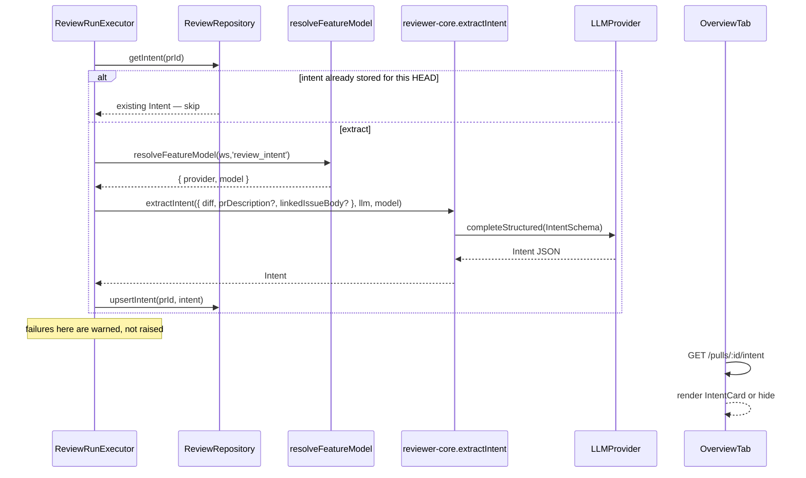

# Development Plan — Intent Layer

## 1. Goal & context

Add an **Intent Layer** to the PR Overview tab that summarises what a PR is trying to do, what is in/out of scope, and which risk areas it touches. The layer is generated by a low-cost LLM call (`review_intent` feature model, default `openai/gpt-4.1`), runs **once per unique HEAD commit**, takes the PR diff + description + linked-issue body as input, and is rendered as a card above the Description block. The Intent extraction must be **best-effort** — never fail a review or block the page — and the wire/DB schemas must grow `risk_areas` as a new additive field.

## 2. Affected packages & modules

- **Backend**: `server/` (`reviews` module, `pulls` module, `db/schema/reviews.ts`, vendor contracts), `reviewer-core/` (new `intent/` directory).
- **Frontend**: `client/` (`client/src/lib/hooks/`, `OverviewTab`, vendor contracts, new `IntentCard` component).
- **Other**: 1 new Drizzle-generated migration; lock-step copy of contracts in both `server/src/vendor/shared/` and `client/src/vendor/shared/`.

## 3. Insights & constraints honored

- **Vendor copies must move in lock-step** — `server/src/vendor/shared/contracts/brief.ts` AND `client/src/vendor/shared/contracts/brief.ts` (server `INSIGHTS.md:18`).
- **No hand-written migration SQL** — edit `db/schema/*.ts`, then `npm run db:generate` (server `INSIGHTS.md:25`).
- **DeepSeek on OpenRouter silently fails strict json_schema** — the registered default for `review_intent` is `openai/gpt-4.1` so this is fine, but the extractor must use `completeStructured` exactly like the conventions extractor (server `INSIGHTS.md:11`).
- **reviewer-core iron rule** — no I/O. `extractIntent` receives only `{ diff, prDescription?, linkedIssueBody? }` + an `LLMProvider`; the server resolves the provider and persists the result (`reviewer-core/CLAUDE.md`).
- **Best-effort enrichment pattern** — like context enrichment (callers digest, repo map): on failure, log a warning and continue, never throw (server `CLAUDE.md`).
- **Module registration is static** — every new server module appears in `server/src/modules/index.ts`. We are NOT adding a new module here (intent endpoint piggybacks on `pulls`), so no change to `index.ts`.
- **ESM** — every relative server/reviewer-core import carries `.js`.
- **Onion architecture** — DB writes go through `ReviewRepository`; reviewer-core stays pure; the server-side LLM provider is resolved from the container.
- **Routes ordering (Fastify)** — `GET /pulls/:id/intent` must be registered after `GET /pulls/:id` (different specific suffix). With current `pulls/routes.ts` shape, registration order does not collide.
- **All client API access goes through `src/lib/api.ts`** (client `CLAUDE.md`).
- **Contracts come from `@devdigest/shared`** — client never hand-duplicates types (client `CLAUDE.md`).
- **i18n** — only `en` locale exists; new UI strings live under a namespace file (client `INSIGHTS.md:29`).
- **Test fixtures**: a required addition to a Zod contract (`risk_areas` on `Intent`) could break fixtures. Use `.default([])` in the schema to keep the change additive.

## 4. Architecture / flow



**Idempotency model**: persistence keyed by `prId` (PK). The gate is **"does `pr_intent` exist for `prId`?"** — yes → skip; no → extract. To re-run on a new HEAD commit, the executor compares `pull.headSha` against `pull.lastReviewedSha`; if they differ, we clear+re-extract. See T-B4 for the exact rule.

## 5. Backend tasks

### T-B1: Add `risk_areas` to the `Intent` contract (both vendor copies) `[backend]`

- **Files**: `server/src/vendor/shared/contracts/brief.ts:9-13`, `client/src/vendor/shared/contracts/brief.ts:9-13` (modify both, lock-step).
- **Change**: extend `Intent` to add `risk_areas: z.array(z.string()).default([])`. Use `.default([])` so old persisted rows / old fixtures still parse — additive change, no client break.
- **Skills**: `zod` (use `.default([])`), `api-contract-review` (additive only).
- **Done when**: `npm run typecheck` green in both `server/` and `client/`; inferred `Intent` type has `risk_areas: string[]`.

---

### T-B2: Add `risk_areas` column to `pr_intent` + generate migration `[backend]`

- **Files**: `server/src/db/schema/reviews.ts:48-55` (modify), `server/src/db/migrations/0013_*.sql` (NEW — auto-generated).
- **Schema**: add `riskAreas: jsonb('risk_areas').$type<string[]>().notNull().default(sql\`'[]'::jsonb\`)` — mirrors `inScope` / `outOfScope` shape; NOT NULL + default-`[]` so existing rows fill correctly.
- **Process**: edit schema → `npm run db:generate` → commit generated SQL untouched → apply with `npm run db:migrate`.
- **Skills**: `drizzle-orm-patterns` (jsonb + default), `postgresql-table-design` (NOT NULL with non-volatile default).
- **Done when**: migration applies cleanly; `select * from pr_intent` shows `risk_areas` defaulted to `[]` on existing rows.

---

### T-B3: Update repository to read/write `risk_areas` `[backend]`

- **Files**: `server/src/modules/reviews/repository/pull.repo.ts:49-68` (modify `upsertIntent` and `getIntent`).
- **Changes**: in `upsertIntent`, include `riskAreas: intent.risk_areas` in both `values` and `onConflictDoUpdate.set`; in `getIntent`, map `row.riskAreas` → `risk_areas`.
- **Skills**: `drizzle-orm-patterns`, `onion-architecture`.
- **Done when**: typecheck green; round-trip insert→read preserves `risk_areas`.

---

### T-B4: Implement `extractIntent` in reviewer-core `[backend]`

- **Files**: `reviewer-core/src/intent/extractor.ts` (NEW), `reviewer-core/src/index.ts` (re-export).
- **Signature**:
  ```ts
  extractIntent(
    input: {
      diff: UnifiedDiff;
      prDescription?: string;
      linkedIssueBody?: string;
      referencedDocs?: Array<{ url: string; content: string }>;
    },
    llm: LLMProvider,
    model: string,
  ): Promise<Intent>
  ```
- **Implementation**: one `llm.completeStructured` call, schemaName `"pr_intent"`, schema = `Intent` from `@devdigest/shared`, `temperature: 0`, `maxTokens: ~1500`. Compact diff digest: file paths + first ~120 lines per file, capped at ~6 KB per file (mirror `MAX_FILE_CHARS` from conventions extractor). Iron-rule pure: no I/O outside injected `llm`.
- **Input priority model** (critical to encode in the prompt, not just in code): the diff is the **sole required input** — intent is always inferred from it. `prDescription`, `linkedIssueBody`, and `referencedDocs` are **optional enrichment layers**, ordered by specificity: a linked plan or spec (`referencedDocs`) is the highest-quality context when available; the linked issue body and PR description follow; the diff alone is always sufficient. A PR with no description and no ticket is the baseline case, not a degraded one.
- **`referencedDocs` in the prompt**: each entry is rendered as a `## Referenced Document (<url>)` section (content capped at ~6 000 chars each, max 3 docs). The system prompt tells the model to treat a referenced plan or spec as the **authoritative statement of intent** when present — the diff is then checked for conformance to it rather than used to infer intent from scratch.
- **Skills**: `typescript-expert`, `zod`.
- **Done when**: unit test mocking `LLMProvider.completeStructured` returns parsed `Intent`; no new I/O imports.

---

### T-B5: Call `extractIntent` from `ReviewRunExecutor` as a pre-work step `[backend]`

- **Files**: `server/src/modules/reviews/run-executor.ts` (modify — insert step after `loadDiff` succeeds, ~line 106), `server/src/modules/reviews/intent-step.ts` (NEW helper).
- **Helper signature**: `runIntentStep(container, repo, workspaceId, pull, diff, runLog): Promise<void>` — best-effort, no return value.
- **Idempotency rule**: if `pull.lastReviewedSha === pull.headSha` AND `await repo.getIntent(pull.id)` exists → skip (log `"Intent already extracted for this HEAD — skipping"`). Otherwise extract. `markReviewed` is called later in `runOneAgent` (after review), so the first run of a new HEAD always extracts.
- **Linked-issue body**: attempt to fetch via `container.github().getIssue(repo, n)` after regex-matching `pull.body` for a `closes/fixes/resolves #NNN` reference. Purely opportunistic — missing ticket never degrades the result.
- **Referenced documents (new)**: before calling the extractor, `intent-step.ts` runs a `gatherReferencedDocs(pull.body, gh)` helper that:
  1. Extracts all `https?://` URLs from the PR body via regex.
  2. Filters to likely plan/spec URLs — accepts GitHub blob links (`github.com/.../blob/...`), raw GitHub content (`raw.githubusercontent.com`), and any URL whose surrounding text (within ~100 chars) contains keywords like `plan`, `spec`, `design`, `proposal`, `rfc`, `adr`. Rejects images (`.png`, `.jpg`, `.gif`, `.svg`), package registry links (`npmjs.com`, `pkg.go.dev`), CI badges, and `#fragment`-only anchors.
  3. Converts `github.com/<owner>/<repo>/blob/<ref>/<path>` links to `raw.githubusercontent.com/<owner>/<repo>/<ref>/<path>` for direct text fetch; other URLs are fetched as-is.
  4. Fetches each URL with a 6 s timeout, 64 KB response cap, accepting `text/*` only; strips HTML tags for HTML responses. Skips silently on any error (auth failure, timeout, non-text content).
  5. Returns up to 3 `{ url, content }` entries (first 3 that successfully resolve), each `content` truncated to ~6 000 chars.
  6. If the PR body **itself** contains inline plan or spec content (detected by headings like `## Plan`, `## Spec`, `## Implementation`, `## Design`, `## RFC` in the body text), that content is extracted and prepended as the first entry with `url: "pr-body"` so the model sees it at the highest priority.
- The assembled `referencedDocs` array (empty if nothing resolved) is passed into `extractIntent`. Zero docs → extraction still runs on diff alone.
- **Failure mode**: any throw in the whole step → `runLog.info('Intent extraction skipped: <reason>')` → agent loop continues unaffected.
- **Logging**: `runLog.step('Extracting PR intent', …, { kind: 'tool' })` — same shape as `loadDiff`; a sub-line logs how many referenced docs were resolved (e.g., `"intent: 2 referenced doc(s) fetched"`).
- **Skills**: `onion-architecture`, `security` (all fetched content is untrusted user-controlled data — truncate and never eval; GitHub token used only for GitHub-origin URLs via the existing adapter, not forwarded to arbitrary hosts).
- **Done when**: review run logs `"Extracting PR intent"` once; `pr_intent` row has `risk_areas`; re-run on same HEAD shows `"Intent already extracted"` and does NOT call LLM. A PR body with a GitHub blob link → log shows `"intent: 1 referenced doc(s) fetched"` and the stored `intent` reflects the plan's stated goal.

---

### T-B6: Add `GET /pulls/:id/intent` route `[backend]`

- **Files**: `server/src/modules/pulls/routes.ts` (modify — add route after `GET /pulls/:id/comments`).
- **Contract**: response = `Intent` Zod schema. Workspace-scoped via `getContext`. Returns `404` (NotFoundError) when `getIntent` returns `undefined`. No GitHub call; pure DB read.
- **Wiring**: import `ReviewRepository` lazily inside `pulls/routes.ts` (matches existing `findingRowToDto` cross-import precedent).
- **Skills**: `fastify-best-practices` (`withTypeProvider<ZodTypeProvider>`, `IdParams`, `response` schema), `api-contract-review`.
- **Done when**: `GET /pulls/:id/intent` returns valid `Intent` JSON after a review run; returns `404` before first run.

---

### T-B7: Expose `getIssue` on the `GitHubClient` port `[backend]`

- **Files**: `server/src/vendor/shared/contracts/adapters.ts` (add `getIssue(repo, number): Promise<IssueMeta>` to port if missing), `server/src/adapters/github/octokit.ts` (verify public exposure).
- **Skills**: `onion-architecture` (port shape stays vendor-neutral).
- **Done when**: `container.github().getIssue(repo, n)` compiles; adapter delegates to the existing private implementation.

## 6. UI tasks

### T-U1: Add `useIntent(prId)` hook `[ui]`

- **Files**: `client/src/lib/hooks/intent.ts` (NEW), `client/src/lib/hooks/index.ts` (re-export).
- **Implementation**: `useQuery({ queryKey: ['pr-intent', prId], queryFn: () => api.get<Intent>('/pulls/${prId}/intent'), enabled: !!prId, retry: false })`. On 404 expose `hasIntent = false`, not an error toast.
- **Skills**: `react-best-practices`, `next-best-practices`, `frontend-architecture`.
- **Done when**: hook exported; `prId=null` → idle; 404 → `hasIntent=false`.

---

### T-U2: Build `IntentCard` component `[ui]`

- **Files**: `client/src/app/repos/[repoId]/pulls/[number]/_components/IntentCard/IntentCard.tsx` (NEW), `.../IntentCard/index.ts`, `.../IntentCard/styles.ts`.
- **Sections** (match screenshot):
  - `INTENT` — single sentence
  - `IN SCOPE` — bulleted list
  - `OUT OF SCOPE` — bulleted list (dimmed/crossed-out styling)
  - `RISK AREAS` — chips/badges
- **Empty arrays**: omit the whole section if array is empty.
- **Icons**: verify alias names in `client/src/vendor/ui/icons.tsx` before using — never assume Lucide source names (client `INSIGHTS.md:22`). Suggested: `"Target"` or `"Flag"`.
- **i18n**: add labels (`overview.intent.title`, `…in_scope`, `…out_of_scope`, `…risk_areas`) under whichever namespace `OverviewTab` already imports.
- **Skills**: `react-best-practices` (presentational, no state, no useEffect), `frontend-architecture`, `next-best-practices`.
- **Done when**: four-section layout matches screenshot; omits empty sections; pure render (same props → same output).

---

### T-U3: Mount Intent Layer in `OverviewTab` `[ui]`

- **Files**: `client/src/app/repos/[repoId]/pulls/[number]/_components/OverviewTab/OverviewTab.tsx` (modify), `…/page.tsx:140` (pass `prId` to OverviewTab).
- **Behavior**: take `prId` as new prop → `useIntent(prId)` → if `hasIntent`, render `<IntentCard intent={data} />` above Description. If false, render nothing (best-effort: no "Loading intent…" state shown).
- **Skills**: `react-best-practices`, `frontend-architecture`, `next-best-practices`.
- **Done when**: PR with extracted intent → card shows above description; PR without → description renders unchanged.

---

### T-U4: Surface linked-issue context in Overview (NICE-TO-HAVE) `[ui]`

- **Files**: `OverviewTab.tsx`.
- **Behavior**: `PrDetail.linked_issue` is fetched but never displayed. Render "Linked issue: #N — Title" above Description. Additive only — no API change.
- **Done when**: PR with `closes #123` in body shows issue title and number.

## 7. Parallelization split

- **Backend implementer** (T-B1 server copy, T-B2, T-B3, T-B4, T-B5, T-B6, T-B7): packages `server/` + `reviewer-core/`
- **UI implementer** (T-B1 client copy, T-U1, T-U2, T-U3, T-U4): package `client/`
- **Sequencing constraint**: T-B1 (both vendor copies) must land first so both sides compile against the updated `Intent` shape. After that, backend and UI touch fully disjoint files.

## 8. Out of scope

- `pr_brief` aggregation (Blast Radius / Risks / History / SmartDiff) — separate feature
- Re-running intent on every poll/refresh — only review-runs trigger it
- Editing intent in the UI / accepting/rejecting risk areas — read-only
- Rolling intent cost into `agent_runs.cost_usd` — it's pre-work, not an agent run
- Streaming intent over SSE
- Posting intent to GitHub

## 9. Verification checklist

- [ ] `cd server && npm run typecheck && npm test` — green
- [ ] `cd reviewer-core && npm run typecheck && npm test` — green (new unit test for `extractIntent`)
- [ ] `cd client && npm run typecheck && npm test` — green (new `IntentCard.test.tsx`)
- [ ] `npm run db:generate` produces exactly `0013_*.sql` with `risk_areas` column; `npm run db:migrate` idempotent
- [ ] Trigger review → server log contains `"Extracting PR intent"` → `select * from pr_intent` returns row with `risk_areas`
- [ ] `GET /pulls/:id/intent` → 200 with Intent JSON; pre-review → 404
- [ ] PR overview tab shows Intent Card above Description for a reviewed PR
- [ ] Re-trigger same HEAD → log shows `"Intent already extracted for this HEAD — skipping"` (no duplicate LLM call)
- [ ] Push new HEAD → next run re-extracts (old intent cleared/overwritten)

## 10. Appendix — LLM prompt contract

**Schema name**: `"pr_intent"`

**Output schema** (after T-B1):
```
{ intent: string, in_scope: string[], out_of_scope: string[], risk_areas: string[] }
```

**System prompt**:
> You read a pull request and produce a concise intent summary. Output JSON matching the schema. The `intent` field is ONE sentence stating what this PR is trying to accomplish (engineering language, no marketing tone). `in_scope` is 3-6 short bullet phrases describing what the PR DOES, derived strictly from the diff. `out_of_scope` is 0-5 short phrases describing nearby concerns the PR explicitly does NOT change. `risk_areas` is 0-6 short labels for risk surfaces touched (e.g., "Auth surface touched", "New dependency: ioredis", "Adds Redis round-trip per request").
>
> **Source priority — read in this order**:
> 1. **Referenced plans / specs** (when present): a linked or inline plan is the authoritative statement of intent. Use it to understand *what was meant to be built*. The diff is then cross-checked against the plan, not used to infer intent from scratch.
> 2. **Linked issue body** (when present): may contain acceptance criteria, background, or a ticket spec — useful supporting context.
> 3. **PR description** (when present): the author's own summary; treat as a hint, not ground truth.
> 4. **Diff** (always present): the sole required input and the final arbiter of what was *actually* changed. A PR with no description, no ticket, and no plan is the normal case — infer everything from the diff alone.

**User message sections** (render only sections that have content):
```
## Referenced Plan / Spec — <url>
<fetched content, truncated to ~6 000 chars>

(repeat for each resolved referenced doc, up to 3)

## PR Description (author-supplied)
<prDescription truncated to ~8 000 chars>

## Linked Issue
#<n> — <title>
<linkedIssueBody truncated to ~3 000 chars>

## Diff (authoritative)
### <file path>
<first ~120 lines of the file's patch>

(repeat per changed file; cap at ~12 files / ~16 KB total)
```

Note: `prDescription` budget is **~8 000 chars** (raised from the original 3 000) to accommodate inline plan/spec content that authors paste directly into the PR body.

`completeStructured` validates against the `Intent` Zod schema; `parseWithRepair` retries on JSON errors. On unrecoverable failure the extractor throws and T-B5's caller logs & skips.
