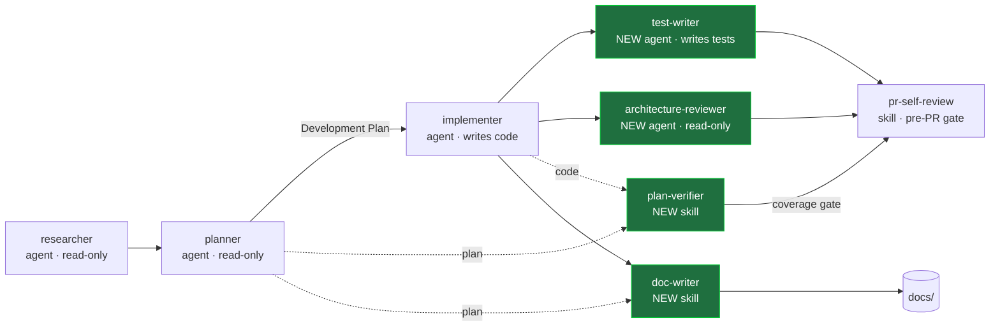

# Development Plan — Test Writer & Architecture Reviewer agents + Plan Verifier & Doc Writer skills

## 1. Goal & context

Extend the DevDigest agent/skill toolkit with four new components that fill gaps in the current `researcher → planner → implementer → pr-self-review` pipeline: a **Test Writer** agent (writes tests for UI + backend), an **Architecture Reviewer** agent (read-only structural review), a **Plan Verifier** skill (checks already-written code against a Development Plan for *requirements coverage*), and a **Doc Writer** skill (turns existing features / plans / arbitrary material into grounded documentation with diagrams). All four are markdown/config files under `.claude/` — this is a meta task, not application code. Each is built on the project's existing 14 skills and encodes external best practices gathered from research.

> **Note:** "JoAi" = the frontend/UI (`client/`), confirmed by the user. The Test Writer covers UI (`client/`) and backend (`server/` + `reviewer-core/`).

## 2. Affected files (no application code)

| Component | Type | File to create | README to update |
|---|---|---|---|
| Test Writer | subagent | `.claude/agents/test-writer.md` | `.claude/agents/README.md` |
| Architecture Reviewer | subagent | `.claude/agents/architecture-reviewer.md` | `.claude/agents/README.md` |
| Plan Verifier | subagent | `.claude/agents/plan-verifier.md` | `.claude/agents/README.md` |
| Doc Writer | subagent | `.claude/agents/doc-writer.md` | `.claude/agents/README.md` |

No changes to `server/`, `client/`, `reviewer-core/`, `e2e/`, DB, or migrations.

## 3. Conventions & constraints honored

- **Agent format** mirrors `researcher.md` / `planner.md` / `implementer.md`: YAML frontmatter (`name`, `description`, `tools`, `model`, optional `skills`/`isolation`) + system-prompt body; every agent gets a catalog row + section + `Based on:` sources in `.claude/agents/README.md`.
- **Skill format** mirrors `.claude/skills/pr-self-review/SKILL.md`: frontmatter `name`/`description`/`user-invocable: true`/`version`, optional companion files, catalog entry in `.claude/skills/README.md`.
- **Read-only by tool scoping, not prose** — Architecture Reviewer omits Write/Edit structurally, like researcher/planner.
- **Testing philosophy** from `TESTING.md`: typological not exhaustive; test at the seams; mock the outside world via `server/src/adapters/mocks.ts`; integration tests are `*.it.test.ts` (real Postgres/testcontainers); client = vitest + RTL/jsdom; reviewer-core = vitest.
- **Skill-bucket split** (UI vs Backend) loaded conditionally, never both at once — same discipline as implementer.

## 4. How the new components slot into the pipeline



The two **agents** are delegation targets (spawned via the Agent tool); the two **skills** are on-demand / `user-invocable`. Test Writer and Architecture Reviewer run *after* the implementer; Plan Verifier cross-checks code against the plan; Doc Writer consumes features or plans and emits to `docs/`.

## 4a. Models & skills at a glance

| Component | Type | Model | Skills |
|---|---|---|---|
| Test Writer | agent | `sonnet` | UI bucket: `react-testing-library`, `zod`, `typescript-expert` · Backend bucket: `fastify-best-practices`, `drizzle-orm-patterns`, `zod`, `security`, `typescript-expert` · always `engineering-insights` (loaded conditionally, never both buckets at once) |
| Architecture Reviewer | agent | `opus` | `onion-architecture`, `frontend-architecture`, `next-best-practices`, `api-contract-review`, `typescript-expert`, `mermaid-diagram`, `engineering-insights` |
| Plan Verifier | agent | `opus` | `typescript-expert`, `onion-architecture`, `frontend-architecture` |
| Doc Writer | agent | `sonnet` | `mermaid-diagram`, `typescript-expert`, `onion-architecture`, `frontend-architecture`, `engineering-insights` |

## 5. Per-deliverable tasks

### T1 — Test Writer (agent)

**File:** `.claude/agents/test-writer.md`

```yaml
---
name: test-writer
description: Writes automated tests for the DevDigest frontend (client/, Vitest + React Testing Library) and backend (server/ + reviewer-core/, Vitest; hermetic unit + real-Postgres *.it.test.ts integration). Use after an implementer lands a feature, or whenever tests need to be authored/extended for an existing change. Applies the UI test skill bucket for client work and the backend bucket for server work, never both at once. Honors the repo's "typological, not exhaustive" philosophy.
tools: Read, Edit, Write, Grep, Glob, Bash, Skill, AskUserQuestion
model: sonnet
skills: react-testing-library, fastify-best-practices, drizzle-orm-patterns, zod, typescript-expert, security, engineering-insights
---
```

**Body outline:**
1. Mission — write *valuable* tests, not coverage filler; one happy path + the edge that matters.
2. Step 1: read the package `INSIGHTS.md` + `AGENTS.md` + `TESTING.md` first (mandatory).
3. Step 2: conditional skill bucket — **UI** (`react-testing-library`, `zod`, `typescript-expert`) vs **Backend** (`fastify-best-practices`, `drizzle-orm-patterns`, `zod`, `security`, `typescript-expert`).
4. Step 3: test-design rules (research-backed, below).
5. Step 4: respect the unit/integration split — hermetic unit via `src/adapters/mocks.ts`; integration tests use `*.it.test.ts` suffix + testcontainers; self-skip when Docker absent.
6. Step 5: run the suite to green, paste evidence, iterate.
7. Structured report (slice, files, test commands + passing output, what was deliberately *not* tested and why).

**Research-backed rules to encode:** RTL query priority `getByRole > … > getByTestId` (last resort); `userEvent.setup()` not `fireEvent`; prefer `findBy*` over wrapping in `waitFor`; never assert internal state; mock **only** I/O boundaries, never same-module collaborators; expected values come from the **spec**, not read off the implementation (no tautological tests); every test has ≥1 falsifiable assertion; delete tests that can't catch a future regression.

**Based on:** Kent C. Dodds [Testing Implementation Details](https://kentcdodds.com/blog/testing-implementation-details) & [Common Testing Mistakes](https://kentcdodds.com/blog/common-testing-mistakes); [Testing Library query priority](https://testing-library.com/docs/queries/about/); Martin Fowler [Practical Test Pyramid](https://martinfowler.com/articles/practical-test-pyramid.html); arXiv [over-mocked agent tests](https://arxiv.org/html/2602.00409v1).

**Done when:** file exists with valid frontmatter; README has its row + section + sources; encodes the UI/backend bucket split and all rules above; agent loads on restart and has Write access.

---

### T2 — Architecture Reviewer (agent)

**File:** `.claude/agents/architecture-reviewer.md`

```yaml
---
name: architecture-reviewer
description: Read-only architectural review for DevDigest. Judges structure at the MACRO level — dependency direction, layer integrity, boundary leaks, coupling/cohesion, ports/adapters, RSC boundaries — NOT line-level style or anything a linter/test catches. Structurally incapable of writing (no Write/Edit). Use to vet a module/feature's design before or after implementation, or on demand.
tools: Read, Grep, Glob, Bash, Skill, WebSearch, WebFetch, AskUserQuestion
model: opus
skills: onion-architecture, frontend-architecture, next-best-practices, api-contract-review, typescript-expert, mermaid-diagram, engineering-insights
---
```

**Body outline:**
1. Mission + read-only contract (no mutation, ever).
2. Scope: macro only — explicitly ignore style/naming/coverage (those are code-review / linter / test concerns).
3. What to check — onion/clean violations: domain importing infrastructure, infra leak into domain, missing port (use-case calling adapter directly), adapter bypass (controller → repo skipping use-case), framework coupling in core; Next.js RSC boundary leaks; coupling/cohesion; contract design via `api-contract-review`.
4. **Evaluator/skeptic pass** — re-verify each finding against file evidence before reporting; a finding that can't be confirmed is downgraded, not dropped silently (cuts false positives).
5. Structured findings: `{area, severity BLOCKER/HIGH/MEDIUM/INFO, rule violated, file:symbol, correct pattern}`; optional dependency/boundary mermaid diagram.
6. Honesty rule (never invent a path/symbol).

**Based on:** Anthropic [Building Agents with the Claude Agent SDK](https://claude.com/blog/building-agents-with-the-claude-agent-sdk) (restricted tools = reduced blast radius); ThoughtWorks [Dependency Drift Fitness Function](https://www.thoughtworks.com/radar/techniques/dependency-drift-fitness-function); [architecture-vs-code-review](https://tech-stack.com/blog/the-architecture-review-process/).

**Done when:** file exists; frontmatter has **no** Write/Edit; README updated; encodes macro-scope + onion heuristics + evaluator pass + structured output; loads on restart.

---

### T3 — Plan Verifier (skill)

**File:** `.claude/skills/plan-verifier/SKILL.md` (+ optional `matrix.md` companion for the traceability-matrix template/severity catalog, mirroring pr-self-review's `gate.md`/`routing.md` split).

```yaml
---
name: plan-verifier
description: "Given a written Development Plan, verifies the code ALREADY written against it. Focus is REQUIREMENTS COVERAGE — proving every plan task and every 'Done when' criterion is implemented AND verified — not general best-practices review. Builds a traceability matrix, demands an evidence artifact per item (passing test / file:line / observable behavior), and gates on any Missing required item. Use after implementation, before pr-self-review, or on demand via /plan-verifier."
user-invocable: true
version: "1.0.0"
model: opus
skills: typescript-expert, onion-architecture, frontend-architecture
---

> **Model & skills (documented intent):** run under **opus** (coverage gating is judgment-heavy / low-false-positive). The procedure loads `typescript-expert`, `onion-architecture`, `frontend-architecture` via the Skill tool when judging whether a cited code path / test genuinely satisfies a criterion. `model`/`skills` in skill frontmatter are documentation only — not enforced by the harness; promote to an agent if hard model-pinning is needed.
```

**Body outline:**
1. Purpose — counterpart to `pr-self-review`: that gate checks *quality*; this one checks *did we build what the plan said*.
2. Inputs — a Development Plan (path/inline) with tasks + "Done when" criteria.
3. Procedure: parse plan → one matrix row per task/criterion → for each, search code/tests for the evidence artifact → assign status.
4. **Status taxonomy:** `Met` (passing test name or inspected `file:line` cited) / `Partial` (code path exists, no test, or test under-covers) / `Missing` (no artifact found after search) / `Unverifiable` (too vague to map to an artifact).
5. **Evidence discipline** — must cite a test name or `file:line` or mark `Unverifiable`; never claim Met without an artifact.
6. Output — traceability matrix table + coverage summary + gate: any `Missing` on a required item → **FAIL**, else **PASS**; list every gap with what's needed to close it.
7. Boundary — does not fix code, does not do style review; reports only.

**Based on:** [Spec-Driven Development (arXiv)](https://arxiv.org/html/2602.00180v1); [Requirements Verification Traceability Matrix](https://softacus.com/blog/requirements-verification-traceability-matrix-rvtm); [evidence accumulation (arXiv)](https://arxiv.org/pdf/2603.02798).

**Done when:** SKILL.md exists with valid frontmatter + `user-invocable: true`; README updated; encodes matrix + 4-state taxonomy + evidence rule + gate; `/plan-verifier` is invocable.

---

### T4 — Doc Writer (skill)

**File:** `.claude/skills/doc-writer/SKILL.md` (+ optional `placement.md` companion for save-location rules + Diátaxis/diagram selection tables).

```yaml
---
name: doc-writer
description: "Documents functionality that already exists. Three modes: (1) document an existing feature from its code, (2) convert a Development/Implementation Plan into documentation, (3) convert arbitrary provided material into documentation — all WITH Mermaid diagrams. Grounds every claim in real source (cites file:line, never invents APIs). Knows exactly where each doc type belongs in the repo. Use on demand via /doc-writer or when asked to document a feature/plan."
user-invocable: true
version: "1.0.0"
model: sonnet
skills: mermaid-diagram, typescript-expert, onion-architecture, frontend-architecture, engineering-insights
---

> **Model & skills (documented intent):** run under **sonnet** (grounded synthesis from source, not gating). The procedure loads `mermaid-diagram` (all diagrams), `typescript-expert`, `onion-architecture`, `frontend-architecture` (to describe structure accurately), and `engineering-insights` (read INSIGHTS for the "why") via the Skill tool. `model`/`skills` in skill frontmatter are documentation only — not enforced by the harness; promote to an agent if hard model-pinning is needed.
```

**Body outline:**
1. Purpose + three modes (feature / plan-to-doc / arbitrary material).
2. **Diátaxis selection** — pick tutorial / how-to / reference / explanation for the request; state which and why.
3. **Grounding rule** — read the real source first; cite `file:line`; never invent APIs/params; if behavior isn't in the code, say "not documented" rather than guess; document the *why*, not just the *what* (the why ages better).
4. **Diagram selection** (delegate to `mermaid-diagram` skill): flowchart=process/wiring, sequence=request/response & event flow, erDiagram=DB schema, classDiagram=TS structure, stateDiagram=lifecycle, C4 Context/Container=architecture (default L1–L2).
5. **Save-location rules** — cross-cutting docs → top-level `docs/`; ADRs → `docs/adr/<nnn>-<topic>.md` (Nygard: Status/Context/Decision/Consequences); feature docs → `docs/features/<name>.md` (new convention); plans → `docs/plans/`; agent-prompt docs → `docs/agent-prompts/`; per-package notes stay in that package's `AGENTS.md`/`INSIGHTS.md` (don't relocate them).
6. Output — the written doc file(s) + a one-line note of what was created where.

**Based on:** [Diátaxis](https://diataxis.fr); [C4 model](https://c4model.com); [Mermaid](https://mermaid.js.org/intro/); [Write the Docs — docs as code](https://www.writethedocs.org/guide/docs-as-code/); ADR (Nygard template).

**Done when:** SKILL.md exists with valid frontmatter + `user-invocable: true`; README updated; encodes 3 modes + Diátaxis + grounding + diagram selection + placement rules; `/doc-writer` is invocable.

## 6. Open questions / decisions to confirm

- **"JoAi" = the frontend/UI (`client/`)** — RESOLVED (confirmed by user).
- **`reviewer-core/` tests:** Test Writer covers it (vitest engine tests), folded into the "backend" bucket. Flag if it should be called out separately.
- **Companion files** (`matrix.md`, `placement.md`): optional. Default is single SKILL.md unless it gets long, matching pr-self-review's split-when-needed pattern.

## 7. Authoring order & parallelization

All four are independent files, so they can be written in parallel. Suggested grouping if sequenced:
1. **Agents first** (T1 Test Writer, T2 Architecture Reviewer) — they share the agent-frontmatter pattern and one README update.
2. **Skills next** (T3 Plan Verifier, T4 Doc Writer) — share the skill pattern and one README update.

Two README files are the only shared edit points (agents/README.md for T1+T2, skills/README.md for T3+T4) — sequence the two edits within each README to avoid collisions.

## 8. Out of scope

- No changes to application code, tests, DB, or the existing agents/skills.
- No new hooks/`settings.json` wiring (Plan Verifier is invoked manually, not gate-enforced like pr-self-review — can be a follow-up).
- Not creating example/reference companion content beyond what's listed.

## 9. Verification

- **Frontmatter valid** for all four; the Architecture Reviewer frontmatter has **no** Write/Edit.
- **Restart Claude Code** (agents load at startup), then: delegate to `test-writer` and `architecture-reviewer` and confirm they appear; invoke `/plan-verifier` and `/doc-writer` and confirm they load.
- Confirm Architecture Reviewer cannot write (tool list excludes Write/Edit).
- Both READMEs render with the new rows/sections and correct source links.
