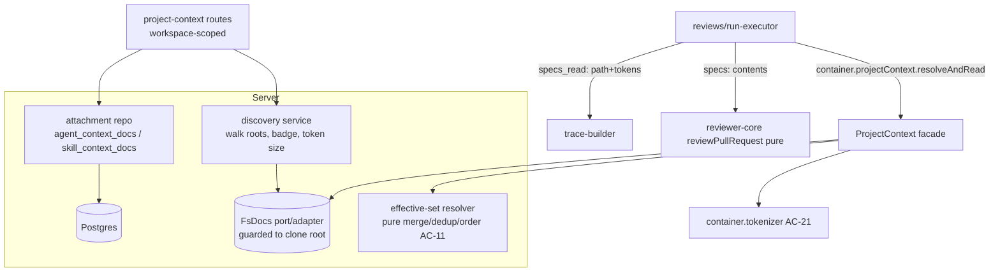

# Implementation Plan — Project Context (SPEC-08)

## 1. Goal & context
Let a reviewer-operator attach repo Markdown (`specs`/`docs`/`insights`) to a review agent and to skills, with a user-controlled order, so that at run time those documents are read from the clone and injected into the existing `## Project context` prompt slot as an untrusted, guarded block. The injection must be verifiable (the run trace lists each embedded doc's path and token size), reproducible (the agent version snapshot captures the ordered paths), workspace-scoped, and degraded-safe (never fails a run; missing docs omitted, oversized context trimmed to a server-side budget). Zero new LLM calls.

## 2. Requirements review
- **Mode chosen:** multi-agent (backend `T-B*`, UI `T-U*`, with one shared pre-work slice done first).
- **Requirements status:** clear & complete. The spec marks all clarifications resolved and supplies precise file:line anchors — all of which were verified against the current code (see below). AC-1..AC-24 are all covered by tasks in §6–§7.
- **Anchor verification (all confirmed against current code):**
  - `repos.clonePath` exposed via `RepoBasics.clonePath` / `RepoIntelRepository.getRepoBasics` — `server/src/modules/repo-intel/repository.ts:63,143`. ✔
  - `agent_skills { agent_id, skill_id, order }` link table — `server/src/db/schema/agents.ts:51-63`; `AgentSkillLink` — `knowledge.ts:236-241`. ✔
  - `AgentVersionConfig` snapshot — `knowledge.ts:248-258`; `agent_versions` — `agents.ts:38-49`; written by `snapshotVersion` — `agents/repository.ts:148-167`. ✔
  - `config.ts:42-82` has `cloneDir` and no context-roots key. ✔
  - `run-executor.ts` calls `reviewPullRequest({...})` at `:201-224`; `specs_read: []` hardcoded at `:294` and `:444`. ✔
  - `reviewer-core` `specs` flows `run.ts:60,134` → `prompt.ts:46-47,94-97,114` (renders `## Project context` via `wrapUntrusted('spec-N', …)`); injection guard at `prompt.ts:16-33`. ✔
  - `specs_read: z.array(z.string())` in BOTH vendor copies — `server/src/vendor/shared/contracts/trace.ts:87` and `client/src/vendor/shared/contracts/trace.ts:86`. `trace-builder.ts:33,52` carries `specsRead: string[]`. ✔
- **Recommendations to improve the requirements (advisory; do not block):**
  - **R1 — pre-existing scaffolding the spec doesn't mention.** `SpecFile` already exists (`platform.ts:258-264`) with only `path/content/size/updated_at`, and a `useContextFiles` hook already calls `GET /repos/:id/context` (`client/src/lib/hooks/core.ts:123-129`) — but **no such server route exists yet** (`repos/routes.ts` has no `/context` handler). The implementer should extend `SpecFile` (add source-root badge, token size, usage count, `missing` flag) rather than invent a parallel contract, and reconcile the existing hook. This is an enhancement note, not a gap.
  - **R2 — `SkillStats.agents`/`used_by_count` vs AC-24 usage count.** AC-24's "Used by N agents" is a *per-document effective-context* count, distinct from the existing skill `used_by_count`. Keep them separate to avoid confusion.
  - **R3 — `IndexStatus.chunks_indexed` reuse.** The footer "chunks" counter (Non-goal §) must read the existing repo-intel index, not a new one — reuse `useReindexContext`/`IndexStatus` already present (`core.ts:131-145`).
- **Open questions resolved during interview:** none (spec is authoritative).

## 3. Affected packages & modules
- **Backend** — package(s) `server/`, `reviewer-core/`:
  - New module `server/src/modules/project-context/` (discovery, attachment persistence, effective-set resolver, run-time read) + one line in `modules/index.ts`.
  - New fs port + adapter (`@devdigest/shared` adapters + `server/src/adapters/fs-docs/`).
  - Container facade wiring (`platform/container.ts`).
  - DB schema: new ordered link tables on agents & skills; migration.
  - Touch `reviews/run-executor.ts` (resolve effective set, populate `specs` + `specs_read`), `platform/trace-builder.ts`, `platform/config.ts`.
  - `reviewer-core` stays **pure** — no code change required to `run.ts`/`prompt.ts` for injection (it already accepts `specs: string[]`); the only reviewer-core consideration is the `specs_read` trace shape lives in the server, not core.
  - Vendor contract edits (server copy): `trace.ts`, `platform.ts` (SpecFile), `knowledge.ts` (AgentVersionConfig, new link contracts).
- **Frontend** — `client/`:
  - New Project Context screen `client/src/app/project-context/` (or under repos) with file list, previews, source badges, token sizes, usage/COVERAGE, chunks footer.
  - New `Context` tab in `AgentEditor` and in `SkillEditor`.
  - Run trace `## Project context` untrusted block in `RunTraceDrawer`.
  - Client hooks + vendor contract copies (lock-step): `trace.ts`, `platform.ts`, `knowledge.ts`.
- **Other:** migration (server `db/schema` + generated SQL); e2e optional (live acceptance demo, out of scope for slices — see §10).

## 4. Insights & constraints honored
- **Shared contracts are TWO hand-maintained vendor copies; edit in lock-step** — `server/src/vendor/shared/` and `client/src/vendor/shared/` (only comments differ). Source: `server/INSIGHTS.md:24`. → The `specs_read` shape change and `SpecFile`/link contract additions are **shared pre-work** (§8) so both copies change together before slices diverge.
- **Barrel `export *` name collisions** — check `grep "export const" vendor/shared/contracts/*.ts` before naming a new contract; pick non-colliding names (e.g. `ContextDocLink`, `EffectiveContextDoc`). Source: `server/INSIGHTS.md:11`.
- **No `depcruise` gate is wired in this starter** — facade-only rule (reach Project Context via `container.*`, never the module internals) is enforced by review, not a script. Don't cite `npm run depcruise`. Source: `server/INSIGHTS.md:33`.
- **New DB columns/tables: edit `db/schema/*.ts`, then `npm run db:generate` (never hand-write SQL), apply `npm run db:migrate`.** Source: `server/INSIGHTS.md:35`; `CLAUDE.md` do-not-touch on `db/migrations/`.
- **Context enrichment is best-effort: omit on error, never throw** — same discipline applies to Project Context read (AC-14). Source: `server/CLAUDE.md`, `server/INSIGHTS.md` repo-intel notes.
- **repo-intel reached ONLY via `container.repoIntel.*`** — Project Context must NOT import repo-intel internals; it receives the clone path (spec §"clone path is provided to the reader"). Source: `server/CLAUDE.md`.
- **Tokenizer already exists** (`adapters/tokenizer/index.ts`, `container.tokenizer`, `ContainerOverrides.tokenizer`) — reuse it as the single token-counting authority (AC-21), do not add a second tokenizer. Source: verified `container.ts:32,133-138`.
- **Adding a tab to AgentEditor requires BOTH `AgentEditor/constants.ts` (TABS) AND `agents/[id]/page.tsx` (VALID_TABS)** or the tab silently redirects. Source: `client/INSIGHTS.md:29`.
- **`@devdigest/ui` icons are aliased; `GripVertical`/`BarChart2` don't exist** — verify against `client/src/vendor/ui/icons.tsx`; use `Edit` (not `Pencil`), `⠿` for drag handles. Source: `client/INSIGHTS.md:26,28`.
- **`useSet*` mutations must invalidate on `onSettled`, not `onSuccess`** (stale optimistic state on failure). Source: `client/INSIGHTS.md:17`.
- **`setParam` is not batch-safe; build one `URLSearchParams`** for multi-param URL writes. Source: `client/INSIGHTS.md:13-15`.
- **reviewer-core iron rule: no I/O.** The server resolves+reads docs to strings before calling `reviewPullRequest`. Source: `reviewer-core/CLAUDE.md`.
- **`POST /import`-style static routes register before `/:id`** (Fastify param shadowing). Apply to any static project-context sub-paths. Source: `server/INSIGHTS.md:21`.
- **`contracts.test.ts` RunTrace fixture has `specs_read: [...]`** (`server/test/contracts.test.ts:165`) — changing the shape breaks it; update in the same change. Source: `server/INSIGHTS.md:39`.

## 5. Architecture / flow
The new `project-context` module has three distinct responsibilities (spec §"Three responsibilities are distinct"): (1) **discovery** (stateless walk of the clone roots), (2) **attachment persistence** (ordered path links on agents & skills), (3) **effective-set resolution** (a pure, DB-free merge/dedup/order function). Filesystem access goes through a new **fs-docs port/adapter**; the run-executor reaches resolution + reading through a **container facade**, never the module internals.



```mermaid
sequenceDiagram
  participant Run as run-executor
  participant PC as ProjectContext facade
  participant FS as FsDocs port (clone root)
  participant Tok as Tokenizer
  participant Core as reviewer-core (pure)
  Run->>PC: resolveEffectiveDocs(agentId, enabledSkillIds, clonePath, budget)
  PC->>PC: merge agent paths + skill paths, dedup, order (AC-11)
  loop each path
    PC->>FS: readWithinRoot(clonePath, path)
    FS-->>PC: content | unreadable(omit)
    PC->>Tok: count(content)
  end
  PC->>PC: admit in order until budget; truncate boundary doc (AC-20)
  PC-->>Run: { contents: string[], read: {path,tokens}[], omitted, truncated }
  Run->>Core: reviewPullRequest({ specs: contents, ... })
  Run->>Run: trace.specs_read = read (path+tokens)
```

## 6. Backend tasks

> Skills bucket for all backend tasks: `onion-architecture`, `fastify-best-practices`, `drizzle-orm-patterns`, `postgresql-table-design`, `api-contract-review`, `zod`, `security`, `typescript-expert`.

### Shared pre-work (single implementer, BEFORE the split — see §8)
- **T-B0: Contracts + schema + migration (shared pre-work)**
  - Verifies: enabling for AC-2, AC-5/6, AC-16/17, AC-19, AC-24 (no AC fully on its own).
  - Files:
    - `server/src/db/schema/agents.ts` and `server/src/db/schema/skills.ts` — add two ordered link tables: `agent_context_docs { agentId, path text, order int }` (PK `(agentId, path)`) and `skill_context_docs { skillId, path text, order int }` (PK `(skillId, path)`), mirroring `agentSkills` (`agents.ts:51-63`). Both reference parent with `onDelete: 'cascade'`; manual index on the FK column per `postgresql-table-design`.
    - `server/src/db/schema.ts` barrel — export new tables.
    - Generate migration: `npm run db:generate` → new `00NN_*.sql` (do NOT hand-write).
    - `server/src/vendor/shared/contracts/trace.ts:87` — change `specs_read: z.array(z.string())` → `z.array(z.object({ path: z.string(), tokens: z.number().int() }))`. Update `PromptAssembly` if a dedicated `specs` slot label is needed (already present at `:43`).
    - `server/src/vendor/shared/contracts/platform.ts:258-264` — extend `SpecFile`: add `source` (enum of root names), `tokens` (int), `used_by_agents` (int), `missing` (bool, default false). Keep `content`/`size`/`updated_at`.
    - `server/src/vendor/shared/contracts/knowledge.ts:248-258` — add `context_docs: z.array(z.string())` to `AgentVersionConfig` (ordered attached paths, AC-19); add `ContextDocLink`/`EffectiveContextDoc` contracts for attach/preview responses (verify names don't collide via grep per INSIGHTS).
    - `server/src/platform/config.ts:42-82` — add `contextRoots: string[]` to `AppConfig` + env key (e.g. `DEVDIGEST_CONTEXT_ROOTS`, comma-split), defaulting to `['specs','docs','insights']` (AC-4).
    - `server/src/platform/trace-builder.ts:33,52` — change `specsRead: string[]` → `specsRead: { path: string; tokens: number }[]`.
    - `server/test/contracts.test.ts:165` — update the `specs_read` fixture to the new shape.
  - Skills to apply: `api-contract-review` (this is a **breaking change** to `specs_read` — applied in lock-step across both vendor copies; the client copy is edited in T-U0), `zod`, `drizzle-orm-patterns`, `postgresql-table-design`, `typescript-expert`.
  - Done when: server typechecks; migration generated; `contracts.test.ts` passes; both new link tables present; `specs_read` is `{path,tokens}[]` in the server vendor copy.

### Backend slice (after pre-work)
- **T-B1: FsDocs port + adapter (clone-root-confined fs)**
  - Verifies: AC-1 (walk), AC-12/security (path-traversal/symlink guards), edge cases (symlink escape, symlink cycle).
  - Files: `server/src/vendor/shared/adapters.ts` (new `FsDocs` interface: `walkMarkdown(rootPath, roots): {path}[]`, `readWithinRoot(rootPath, relPath): string | null`); `server/src/adapters/fs-docs/index.ts` (impl using `node:fs` + `path.resolve`/`realpath`); `server/src/adapters/mocks.ts` (mock for tests); `platform/container.ts` (lazy getter + `ContainerOverrides.fsDocs`).
  - Interfaces/contracts: port speaks the app's language ("walk markdown under roots", "read a doc inside the clone"), no vendor name. Guard: reject absolute paths and `..`; `realpath` each candidate and assert it `startsWith(realpath(rootPath) + sep)`; cycle-safe walk (track visited real dirs, don't follow symlinks out); skip ignored dirs (`.git`, `node_modules`).
  - Skills to apply: `onion-architecture` (port-first), `security` (Path traversal rule — confine to clone root, reject symlink escape), `typescript-expert`.
  - Done when: walk returns only in-root `.md` paths repo-relative; a symlink pointing outside the clone and a symlink cycle are both rejected/non-looping; unit test green.

- **T-B2: Discovery service + route (`GET /repos/:id/context`)**
  - Verifies: AC-1, AC-2, AC-3, AC-4, AC-23, AC-24, Performance (no pagination).
  - Files: `server/src/modules/project-context/{service.ts,routes.ts,repository.ts}`; `server/src/modules/index.ts` (+1 line `projectContext`).
  - Interfaces/contracts: `GET /repos/:id/context` → `SpecFile[]` (path + `source` badge derived from matched root + Markdown `content` + `tokens` via `container.tokenizer` + `used_by_agents` per AC-24). Resolve clone path via the repos repo **as a value passed in** (do not couple discovery to the repo-intel pipeline). Workspace-scope via `getContext(container, req)` (`_shared/context.ts`) and verify the repo belongs to the workspace (AC-23). No clone on disk → empty list + reason, HTTP 200 (AC-3). Config roots drive the glob; fall back to defaults (AC-4). Whole list in one response (no pagination).
  - The AC-24 usage count: derived deterministically from current attachments — for each discovered path, count distinct workspace agents whose effective set (own docs ∪ docs from enabled skills they use) includes it. Implement as a DB-side aggregate or via the resolver over all agents.
  - Skills to apply: `fastify-best-practices` (Zod request/response schema, register static sub-paths before `/:id`), `drizzle-orm-patterns`, `security`, `zod`, `api-contract-review`.
  - Done when: integration tests pass — in-root `.md` only (AC-1); SpecFile carries source+content+tokens (AC-2); no-clone → empty+reason+200 (AC-3); custom-vs-default roots (AC-4); cross-workspace repo denied (AC-23); usage count correct incl. deduped-per-agent and 0 for unattached (AC-24).

- **T-B3: Attachment persistence (agent + skill) routes/repo**
  - Verifies: AC-5, AC-6, AC-7, AC-9 (missing flag in payload), AC-22 (effective-context endpoint), AC-23, concurrent-reorder edge case.
  - Files: `server/src/modules/project-context/{repository.ts,service.ts,routes.ts}` (own the link tables; mirror `AgentsRepository.setSkills`/`linkSkill` at `agents/repository.ts:207-235`).
  - Interfaces/contracts: `GET/PUT /agents/:id/context-docs` and `GET/PUT /skills/:id/context-docs`. PUT replaces the full ordered path list (last-writer-wins full-order replace — safe, cannot leave partial/duplicate order; satisfies concurrent-edit edge). Store **paths only**, never text (AC-5/6). GET returns the stored links plus a `missing` flag per path (cross-check against current discovery for that repo) for AC-9. Also expose `GET /agents/:id/effective-context` → ordered, deduped union (AC-11 order) of own docs + docs inherited from enabled skills, for the AC-22 preview. Workspace-scope all queries (AC-23). When agent config is versioned, attached paths must be captured (handled in T-B5).
  - Skills to apply: `fastify-best-practices`, `drizzle-orm-patterns`, `postgresql-table-design`, `security`, `zod`, `api-contract-review`.
  - Done when: integration tests — attach/detach persists a path link and **text is NOT stored** (AC-5/6); reorder persists order (AC-7, run-assembly part proven in T-B4/T-B6); a stored path with no clone match returns `missing: true` (AC-9); effective-context endpoint returns inherited docs in AC-11 order (AC-22 data side); cross-workspace attach denied (AC-23).

- **T-B4: Effective-set resolver (pure, DB-free) + budget/trim policy**
  - Verifies: AC-10 (set union), AC-11 (dedup + agent-first order), AC-20 (budget/trim), AC-13 (zero LLM), Determinism.
  - Files: `server/src/modules/project-context/resolver.ts` (pure function over collected paths — testable without DB/fs); budget admission helper.
  - Interfaces/contracts: `resolveOrder({ agentPaths, skillGroups })` → ordered, deduped path list (agent's own first in stored order, then skill-inherited not already present, in skill order then per-skill attachment order — AC-11). `admitToBudget({ docs:[{path,content,tokens}], budget })` → `{ included, truncated, excluded }`: admit whole docs in assembly order until budget; the boundary-crossing doc is truncated to fit; whole preferred over partial where both fit; record excluded/truncated (AC-20). Budget = configurable server-side share of the model's usable window after reserving system/skills/repo-intel/diff (config-driven constant acceptable for this feature).
  - Skills to apply: `typescript-expert`, `zod` (for the config), `onion-architecture` (keep it pure/DB-free).
  - Done when: unit tests — duplicate path across levels appears once with agent-first order preserved (AC-11); disabled skill's docs excluded (edge case, fed by enabled-skill filter); over-budget set trims in order and records excluded/truncated, never throws (AC-20).

- **T-B5: Agent version snapshot captures ordered doc paths**
  - Verifies: AC-19.
  - Files: `server/src/modules/agents/repository.ts:148-167` (`snapshotVersion`) — read the agent's ordered context-doc paths (via the project-context repo, reached through the container facade, NOT a direct module import) and write them into `configJson.context_docs`; `isConfigChange` (`agents/helpers.ts`) — treat a context-doc change as a config-affecting change so it bumps the version. Eval replay must read `context_docs` from the snapshot rather than live attachments.
  - Interfaces/contracts: `AgentVersionConfig.context_docs: string[]` (added in T-B0). Cross-module access only via `container.*` per onion rule.
  - Skills to apply: `onion-architecture` (no cross-module internal import; reach project-context via container), `drizzle-orm-patterns`, `typescript-expert`, `api-contract-review`.
  - Done when: integration test — snapshot an agent with attached docs; mutate live attachments; replay the snapshot version → original doc set injected (AC-19).

- **T-B6: Run-time injection + trace wiring (run-executor + container facade)**
  - Verifies: AC-10, AC-11, AC-12, AC-13, AC-14, AC-15, AC-16, AC-17, AC-18 (data side), AC-21, AC-23, "clone updated between attach and run" edge.
  - Files: `server/src/platform/container.ts` (add `projectContext` facade getter: `resolveAndRead(...)` composing T-B1 fs read + T-B4 resolver + `tokenizer`); `server/src/modules/reviews/run-executor.ts:191-224` (before `reviewPullRequest`, resolve effective set: agent's own paths + paths from **enabled** skills the agent uses; this is **independent of `repoIntel` toggle** at `:173-187` — AC-15; read within clone root, omit unreadable, trim to budget; pass `specs: contents`); `:294` and `:444` (`specs_read: []` → the `{path,tokens}[]` from the facade); `platform/trace-builder.ts` consumers as needed.
  - Interfaces/contracts: facade returns `{ contents: string[], read: {path,tokens}[], omitted: string[], truncated: string[] }`. The `## Project context` block is produced by the **existing** `assemblePrompt` (`reviewer-core/prompt.ts:114`) wrapping each in `<untrusted source="spec-N">` (AC-12) — no reviewer-core change. Zero new LLM calls (AC-13). Missing/unreadable docs omitted, run continues (AC-14). The trace records the path actually read (live clone) — covers the "clone updated" edge.
  - Skills to apply: `onion-architecture` (facade-only access; reviewer-core stays pure), `security` (untrusted injection through existing guard), `typescript-expert`, `api-contract-review`.
  - Done when: integration tests — agent own-docs + skill-docs union read & injected (AC-10/AC-11); deleted file omitted, run completes (AC-14); `repo_intel=false` agent still injects its docs (AC-15); trace `specs_read` lists each embedded path AND its token count (AC-16/AC-17); model-call count unchanged (AC-13); over-budget set trims and records (AC-20 end-to-end); editor estimate and trace size for the same doc agree because both use `container.tokenizer` (AC-21).

## 7. UI tasks

> Skills bucket for all UI tasks: `frontend-architecture`, `next-best-practices`, `react-best-practices`, `react-testing-library`, `zod`, `security`, `typescript-expert`. Design refs handed to every UI task: `designs/project-context/01.png` (screen), `02.png` (agent Context tab), `03.png` (skill Context tab + effective preview), `04.png` (run-trace prompt-assembly block).

### Shared pre-work (single implementer, BEFORE the split — see §8)
- **T-U0: Client vendor contract copies (lock-step with T-B0)**
  - Verifies: enabling for all UI ACs (no AC on its own).
  - Files: `client/src/vendor/shared/contracts/trace.ts:86` (`specs_read` → `{path,tokens}[]`); `client/src/vendor/shared/contracts/platform.ts:258-264` (`SpecFile` extended fields); `client/src/vendor/shared/contracts/knowledge.ts` (`AgentVersionConfig.context_docs`, `ContextDocLink`/`EffectiveContextDoc`). Must be byte-compatible with the server copies from T-B0 (only comments may differ).
  - Skills to apply: `zod`, `typescript-expert`, `api-contract-review`.
  - Done when: client typechecks against the new shapes; both vendor copies match the server copies.

### UI slice (after pre-work)
- **T-U1: Project Context screen** (design `01.png`)
  - Verifies: AC-2, AC-3, AC-24, Non-goal preview/read-only + chunks footer.
  - Files: `client/src/app/project-context/page.tsx` + `_components/` (file list, source-root badge, Markdown preview pane with **Preview/Edit toggle that is read-only**, per-doc token size, "Used by N agents", COVERAGE indicator = N-of-total agents, footer "chunks" counter from existing `IndexStatus`); reuse/repair `useContextFiles` (`core.ts:123-129`); nav entry (`vendor/ui/nav.ts`) + i18n keys.
  - Component/route/data flow: container component fetches via `useContextFiles(repoId)`; handles loading/empty (AC-3 reason)/error; presentational rows render badge + tokens + usage. Preview/Edit is a view toggle only — no persistence (Non-goal). Chunks footer reads existing repo-intel index (`useReindexContext`/`IndexStatus`), not a new index.
  - Skills to apply: `next-best-practices` (RSC/client boundary, `'use client'` for interactive list), `frontend-architecture` (colocated `_components`), `react-best-practices` (derive don't store; container/presentational split), `react-testing-library`, `security` (render Markdown safely — no `dangerouslySetInnerHTML` without sanitize).
  - Done when: screen renders each doc with source badge + token size + Markdown preview (AC-2); empty/no-clone state shows the reason (AC-3); "Used by N agents" + COVERAGE render the usage count (AC-24); Preview/Edit is read-only. RTL tests: list renders, badge rendering, empty state.

- **T-U2: Agent Context tab** (design `02.png`)
  - Verifies: AC-5, AC-7, AC-8, AC-9, AC-22.
  - Files: `client/src/app/agents/[id]/_components/AgentEditor/_components/ContextTab/ContextTab.tsx`; register in BOTH `AgentEditor/constants.ts` (TABS) AND `agents/[id]/page.tsx` (VALID_TABS) — per INSIGHTS or it silently redirects; new hooks in `client/src/lib/hooks/` (`useAgentContextDocs`, `useSetAgentContextDocs` — invalidate on **`onSettled`** per INSIGHTS).
  - Component/route/data flow: list discovered docs with attach/detach checkbox + source badge + per-doc token size + **Preview** (read-only); HTML5 drag reorder (drag handle `⠿`, not `GripVertical`); running **total token estimate** of attached docs (AC-8) computed by summing `SpecFile.tokens` (same authority as server, AC-21); missing doc indicator (AC-9). Read-only **effective-context preview** = deduped/ordered union of own docs + docs inherited from the agent's enabled skills, in AC-11 order (AC-22) — fetched from `GET /agents/:id/effective-context` (T-B3). Multi-param URL writes via a single `URLSearchParams` (INSIGHTS).
  - Skills to apply: `react-best-practices` (derive estimate, no `useEffect` for derived state; key props stable on reorder), `frontend-architecture`, `next-best-practices`, `react-testing-library`, `security`, `typescript-expert`.
  - Done when: attach/detach + reorder persist (AC-5/AC-7 — persistence proven by backend, UI wires it); token estimate updates as docs toggle (AC-8); missing doc flagged (AC-9); effective-context preview shows skill-inherited docs in AC-11 order (AC-22). RTL tests: toggle updates estimate; effective preview renders inherited docs.

- **T-U3: Skill Context tab** (design `03.png`)
  - Verifies: AC-6, AC-7 (skill side), AC-8 (skill side).
  - Files: `client/src/app/skills/[id]/_components/SkillEditor/_components/ContextTab/ContextTab.tsx`; register the tab in the SkillEditor tab system (mirror SkillEditor's existing tab files); hooks `useSkillContextDocs`/`useSetSkillContextDocs` (`onSettled` invalidation).
  - Component/route/data flow: same attach/detach/reorder/preview/token-estimate UX as T-U2, bound to `PUT /skills/:id/context-docs`. The "Project specifications" effective preview block from `03.png` shows the skill's own attached docs (read-only). Source badges + token sizes from `SpecFile`.
  - Skills to apply: `react-best-practices`, `frontend-architecture`, `next-best-practices`, `react-testing-library`, `security`, `typescript-expert`.
  - Done when: attach/detach/reorder persist on the skill (AC-6/AC-7); token estimate updates (AC-8). RTL test: toggle + estimate.

- **T-U4: Run-trace Project context block** (design `04.png`)
  - Verifies: AC-18, AC-16/AC-17 (display side).
  - Files: `client/src/app/repos/[repoId]/pulls/[number]/_components/RunTraceDrawer/_components/TraceBody/TraceBody.tsx:39-52` (render `specs_read` as `{path,tokens}[]` — path + token size per doc, not bare strings); add the **`## Project context` — attached specs (untrusted)** labeled block to the Prompt assembly section alongside System/Skills/Repo skeleton/Callers/Diff (the `prompt_assembly.specs` slot, `trace.ts:43`); `RunTraceDrawer/RunTraceDrawer.test.tsx:15` update fixture to new `specs_read` shape; i18n keys.
  - Component/route/data flow: presentational; reads the persisted `RunTrace`. Label the block "untrusted" to mirror the prompt's guard wrapping (AC-18). Show per-doc path + token count under "Specs read" (AC-16/AC-17 display).
  - Skills to apply: `react-best-practices`, `react-testing-library`, `next-best-practices`, `typescript-expert`.
  - Done when: prompt-assembly view shows a labeled untrusted `## Project context` block (AC-18); "Specs read" lists path + token size per embedded doc (AC-16/AC-17 surfaced). RTL test: block present + labeled untrusted; trace fixture updated.

## 8. Execution split
**Shared pre-work (one implementer, FIRST — both slices depend on it):**
- **T-B0** (server contracts/schema/migration/config) and **T-U0** (client vendor copies). These touch the shared `specs_read`/`SpecFile`/`AgentVersionConfig` contracts that *both* slices read; the `specs_read` change is breaking, so it must land lock-step in both vendor copies before parallel work begins. Assign T-B0+T-U0 to a single implementer (vendor copies must be edited together). Migration generated here.

**After pre-work, two parallel implementers on disjoint file sets:**
- **Backend implementer owns:** T-B1, T-B2, T-B3, T-B4, T-B5, T-B6 — packages `server/` (`modules/project-context/**`, `adapters/fs-docs/**`, `platform/container.ts`, `platform/trace-builder.ts`, `modules/reviews/run-executor.ts`, `modules/agents/repository.ts`, `modules/index.ts`, `adapters/mocks.ts`, `vendor/shared/adapters.ts`) and `reviewer-core/` (no edit expected; pure). Server `vendor/shared/contracts/*` already finalized in T-B0.
- **UI implementer owns:** T-U1, T-U2, T-U3, T-U4 — package `client/` only (`app/project-context/**`, `app/agents/[id]/**` Context tab, `app/skills/[id]/**` Context tab, `RunTraceDrawer/**`, `lib/hooks/**`, `vendor/ui/nav.ts`, i18n). Client `vendor/shared/contracts/*` already finalized in T-U0.

No file is touched by both slices: backend never edits `client/`; UI never edits `server/` or `reviewer-core/`. The one coupling — the contract shapes — is fully resolved in shared pre-work.

## 9. Out of scope
- Auto-selection / "flash selector" of docs per PR (spec Non-goal).
- Embedding document **text** in agent/skill metadata or saved prompt templates (paths only).
- Persisting Preview/Edit edits to the clone or any overlay (read-only toggle).
- Any new LLM call, and semantic chunking/embedding of these docs (footer chunks = existing repo-intel index).
- Pagination of the discovery endpoint (whole list in one response).
- The e2e/live acceptance demo automation (named in §10 as manual verification; not a slice task).

## 10. End-to-end verification
- **Existing suites that must pass:**
  - Server: `cd server && npm run typecheck && npm test` (includes the new `*.it.test.ts` for project-context and the updated `contracts.test.ts`).
  - Client: `cd client && npm run typecheck && <client test runner>` (Vitest/RTL for the new screen, Context tabs, trace block; updated `RunTraceDrawer.test.tsx`).
  - reviewer-core: `cd reviewer-core && npm test` (must stay green with no source change — proves purity preserved).
  - DB: `npm run db:generate` produced a migration; `npm run db:migrate` applies cleanly.
- **New behavior proven by:**
  - Discovery: AC-1/AC-3/AC-4/AC-23/AC-24 integration tests (seeded clone, no-clone, custom roots, cross-workspace, usage count = 2 / = 0).
  - Attach/order: AC-5/AC-6 (text not stored), AC-7 (order → assembly), AC-9 (missing flag).
  - Resolver: AC-11 (dedup + agent-first), AC-20 (trim-to-budget, records excluded/truncated, no failure) — unit + integration.
  - Run-time: AC-10/AC-13/AC-14/AC-15/AC-16/AC-17/AC-19/AC-21 integration (union injected; model-call count unchanged; deleted file omitted; `repo_intel=false` still injects; trace path+tokens; snapshot replay reproducibility; editor estimate == trace size).
  - UI: AC-2/AC-8/AC-18/AC-22 RTL (badge+tokens render; estimate updates on toggle; labeled untrusted block in prompt assembly; effective-context preview in AC-11 order).
  - **Live acceptance demo (manual):** attach a spec with an invariant (e.g. "`api/` must not import `db/` directly") to the reviewer, open a violating PR, assert a finding cites the document.
