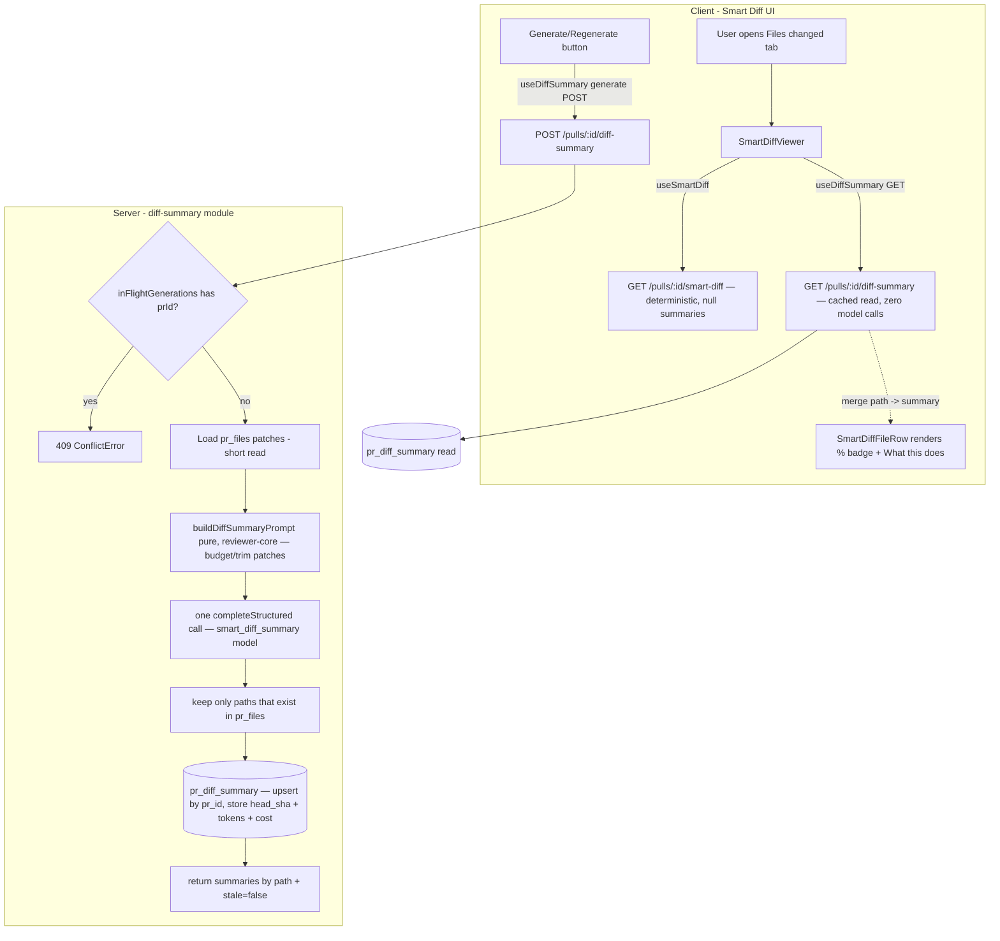

# Implementation Plan — Smart Diff `pseudocode_summary` generation

## 1. Goal & context

Complete the deferred Smart Diff feature by generating a real per-file `pseudocode_summary` — a short one-line "what this file does" description, model-written from each file's diff patch — replacing the hardcoded `null` stub. The full contract (`SmartDiffFile.pseudocode_summary`) and UI (`% summary` badge + "What this does:" row in `SmartDiffFileRow.tsx`) are already wired and null-gated; this work only supplies real data (via a new opt-in, cached generation path) plus a minimal trigger control. `computeSmartDiff` stays free/deterministic so the SPEC-09 Brief aggregator's zero-extra-model-call guarantee is preserved.

## 2. Requirements review

- **Mode chosen: single-agent.** (Recommended over multi-agent: UI work is minimal and gated behind a shared vendor-contract + migration change, so a parallel backend/UI split would leave the UI slice idle and risk two agents editing the same shared vendor/contract files.)
- **Requirements status: clear & complete.** The requirements are unusually specific and file-grounded; every hard constraint was independently verified against the codebase (see §4). No ambiguity blocks planning.
- **Recommendations to improve the requirements:**
  1. Add explicit acceptance criteria for the **empty-input** cases: PRs where every file has `patch == null` (GitHub omits patch for >~1000-line diffs — `client/INSIGHTS.md:42`), and PRs with zero files. The plan handles these (skip null-patch files; return summaries only for files with content), but the requirement should state the expected observable result.
  2. State a concrete **token budget** number rather than "this feature's own call" — the plan proposes per-file and total caps (§6, T-B4) but a requirement-level cap would make it testable.
  3. Clarify the **regenerate-on-stale UX**: the plan chooses a lightweight HEAD-SHA staleness flag reused from the Brief precedent, but does not add a stale badge to the file rows (out of scope, §9). Confirm that's acceptable.
- **Open questions resolved during interview (defaulted with justification, AskUserQuestion unavailable in this environment):**
  - *Trigger policy* → **explicit on-demand (POST), no auto-generate on view.** Justification: matches the app's established cost-consciousness convention (Brief chose explicit-only, `useBrief` has "no auto-generate-on-mount"), and is the only choice that keeps `computeSmartDiff` free for the Brief aggregator per constraint #2.
  - *Cache location* → **new dedicated `pr_diff_summary` table** keyed by `pr_id`, immune to `pr_files` churn (see §4/§6 T-B3).

## 3. Affected packages & modules

- **Backend:** new module `server/src/modules/diff-summary/` (routes + service + repository); new DB table + migration; edit `server/src/modules/index.ts` (registration). Package: `server/`.
- **reviewer-core:** new pure prompt-builder `reviewer-core/src/diff-summary/prompt.ts` + barrel export in `reviewer-core/src/index.ts`. Package: `reviewer-core/`.
- **Shared vendor contracts (lock-step, both copies):** `server/src/vendor/shared/contracts/brief.ts` + `client/src/vendor/shared/contracts/brief.ts` (new response schema); `server/src/vendor/shared/contracts/platform.ts` + client copy (new `FeatureModelId` `smart_diff_summary` + `FEATURE_MODELS` entry).
- **Frontend:** new `client/src/lib/hooks/diffSummary.ts` hook; minimal trigger control in the Smart Diff UI (`SmartDiffViewer.tsx` / `DiffTab.tsx`); wiring the fetched summaries into the existing `SmartDiffFileRow` (no row-render changes). Package: `client/`.
- **Migrations:** one new `db:generate`-produced migration (never hand-written).
- **Not touched:** `computeSmartDiff` in `smart-diff/service.ts` (must stay `null`-emitting and free); the `brief` module.

## 4. Insights & constraints honored

- **`pr_files` is churned on every PR detail view** — `GET /pulls/:id` does `DELETE FROM pr_files WHERE pr_id=…` then re-inserts (source: `server/src/modules/pulls/routes.ts` ~L275-286). Any cache written onto `pr_files` columns is wiped. → Cache lives in its own `pr_diff_summary` table keyed by `pr_id` (survives churn), mirroring `pr_brief`. Source: constraint #1 + `server/src/db/schema/reviews.ts:58`.
- **DeepSeek ignores strict `json_schema` on OpenRouter** — `completeStructured` fails schema validation every attempt. → new `smart_diff_summary` feature-model must default to an OpenAI-family model (openai provider or `openrouter` + `openai/...`). Source: `server/INSIGHTS.md:23`, `reviewer-core/src/llm/openrouter.ts:74-83`.
- **In-process concurrency guard, NOT a DB advisory lock** — the Brief module originally held a `pg_try_advisory_xact_lock` inside a transaction spanning the whole LLM call; an architecture review flagged it HIGH (pooled connection, `max:10`, held for the latency-bound call could exhaust the pool app-wide). It was replaced with a module-level `Set<string>` (`inFlightGenerations`). → reuse the `Set` guard; never open a `container.db.transaction(...)` across the model call. Source: `server/INSIGHTS.md:45`, `server/src/modules/brief/service.ts:52,105-108,227-229`.
- **Record cost/tokens as returned, never recompute** — `completeStructured` returns `costUsd`/`tokensIn`/`tokensOut` (prefers OpenRouter's real `usage.cost`). Source: `reviewer-core/INSIGHTS.md:13`, `server/src/modules/brief/repository.ts`.
- **Vendor contracts are two hand-maintained copies, lock-step** — edit `server/src/vendor/shared/` and `client/src/vendor/shared/` identically (only comments may differ). New contract export names must not clash with existing `brief.ts` exports (`export *` barrel shadows silently). Source: `server/INSIGHTS.md:17,30`.
- **New DB column/table = `npm run db:generate` only**, never hand-write SQL; apply with `npm run db:migrate`. Source: `server/INSIGHTS.md:41`.
- **Static module registration** — new module needs one import + one entry in `server/src/modules/index.ts`. Source: `CLAUDE.md`, `server/CLAUDE.md`.
- **Adding a required field to a contract breaks `server/test/contracts.test.ts` fixtures** — grep `server/test/` for the changed contract name, not just `src/`. Source: `server/INSIGHTS.md:51,55`.
- **No `depcruise` gate exists in this starter** — the onion facade rule is enforced by review, not a script; do not cite `npm run depcruise` in this plan's verification. Source: `server/INSIGHTS.md:39`.
- **Client barrel `index.ts` must omit the `.js` extension** (Next webpack), even though server Node-ESM relative imports carry `.js`. Source: `client/INSIGHTS.md:52`.
- **`@devdigest/ui` icons are aliases** — verify any new icon name against `client/src/vendor/ui/icons.tsx`; a wrong name is a TS error / silent no-render. Source: `client/INSIGHTS.md:28,30`.
- **`setParam` is not batch-safe**; i18n missing key renders raw key. Only relevant if the trigger control adds a URL param or new strings — prefer local state + an existing/added `prReview.json` key. Source: `client/INSIGHTS.md:13,35`.
- **`patch` is `null` for large files** — `parsePatch(null)` → `[]`; generation must skip null-patch files (nothing to summarize) rather than send empty input. Source: `client/INSIGHTS.md:42`.

## 5. Architecture / flow

Generation is a **separate opt-in path** from `computeSmartDiff`. The deterministic `GET /pulls/:id/smart-diff` remains untouched (still emits `pseudocode_summary: null`). Summaries are fetched/generated via a new endpoint pair and merged into the file rows client-side.



**Data flow key points:**
- One **batched** structured call summarizes all changed files at once, output as an array of `{ path, summary }` (constraint #5).
- Cache keyed by `pr_id`, storing a JSON blob `{ summaries: {path: string}[] }` plus `generated_head_sha`, `tokens_in`, `tokens_out`, `cost_usd` — same shape family as `pr_brief`.
- Staleness = `generated_head_sha !== pr.headSha` (reused from Brief, AC-18 precedent); surfaced in the response but no per-row stale badge (§9).

## 6. Backend tasks

### T-B1: Add `smart_diff_summary` feature-model (lock-step, both vendor copies)
- Verifies: none (enabling/infra) — required by constraint #3.
- Files: `server/src/vendor/shared/contracts/platform.ts:15` (add `'smart_diff_summary'` to the `FeatureModelId` enum) and `:44` (add a `FEATURE_MODELS` entry); **identical** edit to `client/src/vendor/shared/contracts/platform.ts`.
- Interfaces/contracts: new registry entry — `{ id: 'smart_diff_summary', label: 'Smart Diff · File Summaries', description: 'Writes a one-line "what this file does" per changed file.', defaultProvider: 'openrouter', defaultModel: 'openai/gpt-4.1-mini' }`. Use the OpenRouter + `openai/...` pattern (like `conventions`) so a single BYO OpenRouter key suffices while still honoring strict json_schema.
- Skills to apply: `zod`, `api-contract-review`, `typescript-expert`, `onion-architecture`.
- Done when: `resolveFeatureModel(container, ws, 'smart_diff_summary')` compiles and returns the new default; both vendor copies differ only in comments.

### T-B2: Add the `DiffSummaryResponse` contract (lock-step, both vendor copies)
- Verifies: the "rendered by the already-built UI" requirement (contract the client consumes).
- Files: `server/src/vendor/shared/contracts/brief.ts` (append new exports) + identical `client/src/vendor/shared/contracts/brief.ts`.
- Interfaces/contracts (avoid name clashes with existing `brief.ts` exports per `server/INSIGHTS.md:17`):
  ```ts
  export const DiffFileSummary = z.object({ path: z.string(), summary: z.string() });
  export const DiffSummaryResponse = z.object({
    summaries: z.array(DiffFileSummary),
    stale: z.boolean(),
    cost_usd: z.number().nullable(),
    tokens_in: z.number().int().nullable(),
    tokens_out: z.number().int().nullable(),
  });
  ```
  The per-file summary the UI reads stays the existing `SmartDiffFile.pseudocode_summary: z.string().nullish()` — the client merges `summaries[path] → pseudocode_summary`, so **no change to `SmartDiffFile`** and no break to `GET /smart-diff`.
- Skills to apply: `zod`, `api-contract-review`, `typescript-expert`.
- Done when: both copies export `DiffSummaryResponse`; `grep "export const" vendor/shared/contracts/*.ts` shows no duplicate name; `server/test/contracts.test.ts` still compiles (no existing fixture references the new names — additive only).

### T-B3: New `pr_diff_summary` cache table + migration
- Verifies: cache immunity to `pr_files` churn (constraint #1).
- Files: `server/src/db/schema/reviews.ts` (append `prDiffSummary` table alongside `prBrief`); then `npm run db:generate` produces `server/src/db/migrations/00NN_*.sql` (do-not-touch dir — generated only, never hand-edited).
- Schema (mirrors `pr_brief`, keyed by `pr_id` so it survives `pr_files` DELETE/re-insert):
  ```ts
  export const prDiffSummary = pgTable('pr_diff_summary', {
    prId: uuid('pr_id').primaryKey().references(() => pullRequests.id, { onDelete: 'cascade' }),
    json: jsonb('json').notNull(),                 // { summaries: {path,summary}[] }
    generatedHeadSha: text('generated_head_sha'),
    tokensIn: integer('tokens_in'),
    tokensOut: integer('tokens_out'),
    costUsd: doublePrecision('cost_usd'),
  });
  ```
- Skills to apply: `drizzle-orm-patterns`, `postgresql-table-design`, `onion-architecture`.
- Done when: migration applies cleanly (verified by the existing Testcontainers `blast.it.test.ts` run, which applies all migrations); `pr_id` PK B-tree covers the only access path (no extra FK index needed — same reasoning as `server/INSIGHTS.md:53`).

### T-B4: Pure prompt-builder in reviewer-core
- Verifies: batched one-call design + input budgeting (constraints #5, #6).
- Files: `reviewer-core/src/diff-summary/prompt.ts` (new); export from `reviewer-core/src/index.ts` (barrel, following the `buildBriefPrompt` block at `:66-78`).
- Interfaces/contracts:
  ```ts
  export interface DiffSummaryFileInput { path: string; patch: string }
  export interface DiffSummaryPromptInputs { prTitle: string; files: DiffSummaryFileInput[] }
  export function buildDiffSummaryPrompt(
    inputs: DiffSummaryPromptInputs, tokenizer: BriefTokenizer,
  ): { messages: BriefPromptMessage[]; includedPaths: string[] };
  ```
  Behavior: no I/O (tokenizer injected, like `buildBriefPrompt`); wrap each patch with `wrapUntrusted` (already exported from reviewer-core) so patch text is treated as data, not instructions; apply a **per-file cap** (e.g. ~500 tokens/file, truncate longer patches) and a **total budget** (e.g. ~8K tokens; drop lowest-priority files once exceeded), returning `includedPaths` so the caller knows which files got a summary. System prompt: "one concise line per file describing what the file does; engineering language; output an array keyed by the exact provided path; never invent a path."
- Skills to apply: `typescript-expert`, `security` (prompt-injection hardening via `wrapUntrusted`), `zod`.
- Done when: `buildDiffSummaryPrompt` is pure (no imports of db/fastify/octokit), returns messages + `includedPaths`, and reviewer-core's type-check `build` passes.

### T-B5: `diff-summary` module — repository + service + routes
- Verifies: real generation populated into the contract, cached, opt-in; keeps `computeSmartDiff` untouched (constraints #2, #4, #5).
- Files: `server/src/modules/diff-summary/repository.ts`, `.../service.ts`, `.../routes.ts` (all new); register in `server/src/modules/index.ts` (one import + one entry).
- Interfaces/contracts:
  - **Repository** (mirrors `brief/repository.ts`; `DbLike = Pick<Db,'select'|'insert'>`): `getDiffSummary(db, prId)` and `upsertDiffSummary(db, prId, { json, generatedHeadSha, tokensIn, tokensOut, costUsd })` (single `insert…onConflictDoUpdate` on `prId` — atomic, no transaction).
  - **Service** (mirrors `brief/service.ts` exactly): module-level `const inFlightGenerations = new Set<string>()`; `generateDiffSummary(container, workspaceId, pr)` and `getCachedDiffSummary(container, pr)`.
    - `generateDiffSummary`: guard `if (inFlightGenerations.has(pr.id)) throw new ConflictError(...)`; `add` then `try/finally delete`. Inside: read `pr_files` via `container.reviewRepo.getPrFiles(pr.id)` (short read, no transaction), filter to files with non-null `patch`; if none → upsert empty `{summaries:[]}` and return. Build prompt via `buildDiffSummaryPrompt(..., container.tokenizer)`. `resolveFeatureModel(container, ws, 'smart_diff_summary')` → `container.llm(provider)` → one `completeStructured({ schema: <array-of {path,summary}>, schemaName:'diff_summary', temperature:0, maxTokens, messages })` wrapped in try/catch → `ExternalServiceError` on failure (no cache write on failure, per Brief precedent). **Ground** the returned summaries: keep only `path`s present in the loaded `pr_files` set (drop hallucinated paths). Upsert cache with `generatedHeadSha: pr.headSha` and the returned `tokensIn/tokensOut/costUsd` (never recomputed). Return `DiffSummaryResponse` with `stale:false`.
    - `getCachedDiffSummary`: read cache; return `undefined` if none; `stale = row.generatedHeadSha !== pr.headSha`. Zero model calls.
    - **Do NOT** open any `container.db.transaction(...)` around the LLM call (constraint #4 / `server/INSIGHTS.md:45`).
  - **Routes** (mirror `brief/routes.ts`): `GET /pulls/:id/diff-summary` → `getContext` → `container.reviewRepo.getPull(ws, id)` (404 if absent) → `getCachedDiffSummary`; return `404` when never generated (client treats 404 as pre-generation, like `useBrief`). `POST /pulls/:id/diff-summary` → same guard → `generateDiffSummary`. Both use `schema: { params: IdParams, response: { 200: DiffSummaryResponse } }`.
- Skills to apply: `onion-architecture`, `fastify-best-practices`, `drizzle-orm-patterns`, `zod`, `security`, `api-contract-review`, `typescript-expert`.
- Done when: `POST /pulls/:id/diff-summary` returns real per-file summaries and writes one `pr_diff_summary` row; a second concurrent POST for the same PR gets 409; `GET` returns the cache (404 before first generation) with correct `stale`; `smart-diff/service.ts` `computeSmartDiff` is byte-for-byte unchanged and the `brief` aggregator path makes no summary call.

## 7. UI tasks

### T-U1: `useDiffSummary` hook
- Verifies: fetch + explicit generate wiring for the already-built row UI.
- Files: `client/src/lib/hooks/diffSummary.ts` (new); export from `client/src/lib/hooks/index.ts` (barrel — **omit `.js` extension**, per `client/INSIGHTS.md:52`).
- Component/route/data flow: mirror `useBrief` (`client/src/lib/hooks/brief.ts`) exactly — `useQuery(['diff-summary', prId], GET /pulls/:id/diff-summary, { enabled:!!prId, retry:false })` (404 = pre-generation, not an error), plus a `useMutation` calling `POST /pulls/:id/diff-summary` with `onSuccess` writing straight into the `['diff-summary', prId]` cache. Expose `{ summaries, hasSummaries, isGenerating, isStale, generate, generateFailed, resetGenerateError }`. Build a `Map<path, summary>` for the viewer to consume.
- Skills to apply: `react-best-practices`, `frontend-architecture`, `typescript-expert`, `zod`.
- Done when: hook compiles against the imported `DiffSummaryResponse` from `@devdigest/shared` (never hand-duplicated); 404 does not surface as an error.

### T-U2: Merge summaries into rows + add the trigger control
- Verifies: the requirement's visible outcome — the `% summary` badge and "What this does:" row render real text.
- Files: `client/src/app/repos/[repoId]/pulls/[number]/_components/SmartDiffViewer/SmartDiffViewer.tsx` (call `useDiffSummary(prId)`, thread `summaryByPath` down to rows; add a small "Generate summaries" / "Regenerate" button in the existing header/stats row) and `.../SmartDiffGroupSection.tsx` (pass `summary` through to `SmartDiffFileRow`). **`SmartDiffFileRow.tsx` render body is NOT modified** — it already null-gates on `file.pseudocode_summary != null`; supply the value by merging `summaryByPath.get(file.path)` into the file object (or add a `summary?: string` prop the row reads before its existing null-gate). Confirm `prId` is available in `SmartDiffViewer` (thread from `DiffTab.tsx` if not already present).
- Component/route/data flow: button is disabled while `isGenerating`; shows "Regenerate" once `hasSummaries`; on click calls `generate()`. Use local state only (no URL param — avoids the `setParam` batch-safety trap, `client/INSIGHTS.md:13`). Any new label goes in `client/messages/en/prReview.json` (missing key renders raw key). Verify any icon name against `client/src/vendor/ui/icons.tsx` before use.
- Skills to apply: `react-best-practices`, `frontend-architecture`, `next-best-practices`, `typescript-expert`.
- Done when: after clicking Generate, changed-file rows show `% <summary>` collapsed and "What this does: <summary>" when expanded; files GitHub returned no patch for show no summary (nothing to summarize); the button reflects generating/regenerate states.

### T-U3: Component test for the trigger + merge flow
- Verifies: the generate→render user flow (regression guard).
- Files: `client/src/app/repos/[repoId]/pulls/[number]/_components/SmartDiffViewer/SmartDiffViewer.test.tsx` (new, if a client test setup exists; otherwise co-located per RTL conventions).
- Component/route/data flow: RTL + MSW — mock `GET /pulls/:id/smart-diff` (null summaries) and `GET/POST /pulls/:id/diff-summary`; assert (1) no summary badge before generation, (2) clicking "Generate summaries" then finding the summary text via `findByText`, (3) a file with a null summary shows no badge. One or two flow tests, not per-assertion.
- Skills to apply: `react-testing-library`, `react-best-practices`.
- Done when: tests pass and cover the pre/post-generation states.

## 8. Execution split

**Single-agent — one ordered task list with dependencies:**

`T-B1 (feature-model) → T-B2 (contract) → T-B3 (table+migration) → T-B4 (reviewer-core prompt) → T-B5 (module: repo→service→routes→register)` — the backend must be complete and the shared contracts (`DiffSummaryResponse`) in place before the UI can consume them → then `T-U1 (hook) → T-U2 (merge + trigger) → T-U3 (test)`.

Sequencing note: T-B1 and T-B2 (both vendor lock-step edits) come first because both server and client depend on them. T-B3's migration should be generated before T-B5 references the table. No parallelism is warranted.

## 9. Out of scope

- Any change to `computeSmartDiff` / `smart-diff/service.ts` behavior, or to the `GET /pulls/:id/smart-diff` deterministic response (stays `pseudocode_summary: null`).
- Any change to the `brief` module or its aggregation path.
- A per-row **stale badge** on Smart Diff file rows (staleness is tracked in the response via `stale`, and Regenerate is available, but no new badge UI — proportionate to a cheap one-liner feature; the Brief-style HEAD-SHA badge is not replicated here).
- Auto-generation on Smart Diff view (explicitly rejected for cost control).
- Editing `SmartDiffFileRow.tsx`'s render body (already renders the summary; only data supply changes).
- Per-file individual LLM calls (design is one batched call).
- Hand-writing migration SQL or editing `server/src/db/migrations/` by hand.

## 10. End-to-end verification

- **Existing tests that must still pass:**
  - Server: `cd server && npm run typecheck && npm test` (includes `blast.it.test.ts`, which applies all migrations via Testcontainers — proves the new `pr_diff_summary` migration is clean; and `contracts.test.ts` — proves the additive contract change didn't break fixtures).
  - reviewer-core: `cd reviewer-core && npm run build` (type-check) — proves the pure `buildDiffSummaryPrompt` compiles and stays I/O-free.
  - Client: `cd client && npm run typecheck` and the client test runner (for T-U3), plus a `next dev` page load to confirm the barrel edit didn't break webpack resolution (`client/INSIGHTS.md:52`).
- **New behavior proven by:**
  - New server integration test (recommended, following `blast.it.test.ts` with an injected `llm` mock via `ContainerOverrides`): `POST /pulls/:id/diff-summary` returns per-file summaries and writes one `pr_diff_summary` row; a second concurrent POST returns 409; `GET` returns the cache with `stale` toggling when `pr.headSha` changes; `GET` is 404 before first generation.
  - Client RTL test (T-U3): Generate → summary text appears in the row.
  - Manual: open a PR's "Files changed" tab, click "Generate summaries", confirm `% <summary>` on collapsed core rows and "What this does:" on expand; reopen the tab (which churns `pr_files`) and confirm summaries **persist** (proves churn-immunity).
- **Do NOT cite** `npm run depcruise` — no such gate exists in this starter (`server/INSIGHTS.md:39`). Running these commands is the implementer's/`pr-self-review`'s job, not the planner's.

## Key files the implementer will touch (all absolute)

- `/Users/shakhman/Documents/pet-projects/dev-digest/server/src/vendor/shared/contracts/platform.ts` + `/Users/shakhman/Documents/pet-projects/dev-digest/client/src/vendor/shared/contracts/platform.ts`
- `/Users/shakhman/Documents/pet-projects/dev-digest/server/src/vendor/shared/contracts/brief.ts` + `/Users/shakhman/Documents/pet-projects/dev-digest/client/src/vendor/shared/contracts/brief.ts`
- `/Users/shakhman/Documents/pet-projects/dev-digest/server/src/db/schema/reviews.ts` (+ generated migration under `server/src/db/migrations/`)
- `/Users/shakhman/Documents/pet-projects/dev-digest/reviewer-core/src/diff-summary/prompt.ts` + `/Users/shakhman/Documents/pet-projects/dev-digest/reviewer-core/src/index.ts`
- `/Users/shakhman/Documents/pet-projects/dev-digest/server/src/modules/diff-summary/{repository,service,routes}.ts` + `/Users/shakhman/Documents/pet-projects/dev-digest/server/src/modules/index.ts`
- `/Users/shakhman/Documents/pet-projects/dev-digest/client/src/lib/hooks/diffSummary.ts` + `/Users/shakhman/Documents/pet-projects/dev-digest/client/src/lib/hooks/index.ts`
- `/Users/shakhman/Documents/pet-projects/dev-digest/client/src/app/repos/[repoId]/pulls/[number]/_components/SmartDiffViewer/{SmartDiffViewer,SmartDiffGroupSection}.tsx`

Reference patterns to copy (do not modify): the entire `server/src/modules/brief/` module, `reviewer-core/src/brief/prompt.ts`, and `client/src/lib/hooks/brief.ts` + `client/src/app/repos/[repoId]/pulls/[number]/_components/BriefCard/BriefCard.tsx`.
