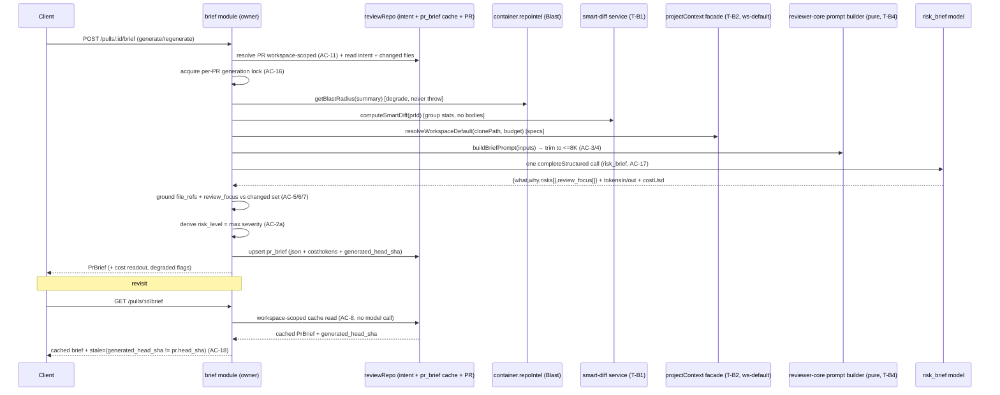

# Implementation Plan — Why+Risk Brief (SPEC-09)

## 1. Goal & context
Turn already-computed, deterministic PR signals (Intent, Blast Radius summary, Smart Diff group stats, linked issue folded into Intent, and workspace-default Project Context specs) plus **one** structured `risk_brief` LLM call into a short model-written narrative `{ what, why, risks[], review_focus[] }`, rendered as a **PR BRIEF** card at the top of the Overview tab. `risk_level` is derived server/client-side as the max severity across `risks[]`. The brief is cached per PR (button-triggered generation only), grounds every file reference against the real changed-file set, and composes the existing review's score/verdict/finding-counts by reading them (zero extra cost).

## 2. Requirements review
- **Mode chosen:** **Multi-agent** (recommended). The backend/UI split is clean and non-overlapping; the one hard dependency both sides share (the `PrBrief` contract redefinition, both vendor copies) is isolated into a **sequenced shared pre-work task (T-S1)** that must land before the parallel split. If a single implementer is preferred instead, collapse §8 into the linear order given there — nothing else changes.
- **Requirements status:** **Largely clear & complete** — every EARS AC is testable and traceable. A few **factual inaccuracies in the spec's grounding references** were found (they do not change scope but the implementer must not trust them blindly):
  - **`brief` module slot is NOT reserved.** The spec's Module boundaries § claims "the static module registry already reserves a `brief` slot." It does not — `server/src/modules/index.ts:29-43` has no `brief` entry. The implementer must add the module + one registry line (standard "add a module" move). Treat this as a normal new-module task, not a pre-existing slot.
  - **`container.projectContext` has no workspace-default method.** The facade (`server/src/platform/container.ts:57-135`) exposes only `resolveAndRead` (needs explicit agent/skill path lists) and `resolveForRun` (**requires an `agentId`**). There is **no** "workspace-default level, no agent overrides" entry point. The brief needs a new facade method (e.g. `resolveWorkspaceDefault({ clonePath, budget })`) or to drive `ProjectContextService.discoverFiles` + `resolveAndRead` directly. This is real net-new backend work the spec understates — pinned as **T-B2**.
  - **Blast and Smart Diff have no reusable service function.** Both compute entirely inside `routes.ts` (`blast/routes.ts:24-121`, `smart-diff/routes.ts:19-109`); there is no `service.ts` in either module. The spec's Module-boundaries § anticipated this ("may require the current in-route computation to be exposed as a reusable service function") — confirmed required, pinned as **T-B1**.
  - **`platform.ts` line refs are off by a few lines** but content is correct: `risk_brief` is a registered `FeatureModelId` with an OpenAI-family default (`openai / gpt-4.1`) at `platform.ts:59-65`. AC-17 pre-handled.
- **Recommendations to improve the requirements:**
  1. **Correct the "reserved `brief` slot" and "`container.projectContext.*` exists" claims** in the spec, or downgrade them to "to be created" — they read as pre-existing and will mislead. (Recommendation only; do not rewrite the spec.)
  2. **Name the extraction explicitly as an AC.** AC-1 depends on reusable Blast/Smart-Diff signal access, but no AC mandates the service extraction. Consider adding an AC (or a note under AC-1) so `plan-verifier` can gate it. Covered here by T-B1 regardless.
  3. **Concurrency mechanism (AC-16) is unspecified.** The spec says "reject/serialise" but the codebase has no existing per-PR generation lock primitive. The plan picks one (advisory lock, below) so the implementer isn't inventing infra silently.
- **Open questions resolved during interview:** none outstanding — the spec's "Resolved decisions" section closed all `[NEEDS CLARIFICATION]` items (contract naming, staleness column, Project-Context-default level, score/chip composition, `risk_level` derivation, trim order). Verified independently against code; all internally consistent.

## 3. Affected packages & modules
- **Backend:** new `brief` module (`server/src/modules/brief/`); modified `blast` and `smart-diff` (extract route logic to `service.ts` — T-B1); modified `project-context` facade (`container.ts`, T-B2); DB schema `reviews.ts` + a new migration; `modules/index.ts` (register `brief`). Packages: `server/`. `reviewer-core/` optionally hosts a **pure prompt-builder + trim function** (no I/O) — see T-B4.
- **Frontend:** `client/` — new `BriefCard` component tree + `useBrief` hook; `OverviewTab.tsx` (render card above the Intent/Blast row); `page.tsx` (already threads `prId`/`repoFullName`/`headSha` — reuse). Reuse `usePrReviews` for score/verdict/findings and `formatCost` for the cost readout.
- **Other:** shared contract `brief.ts` (both vendor copies, lock-step — T-S1); new drizzle migration (`db:generate`); server + client tests. No `e2e/` changes required (spec verifies via unit/integration/client tests + a manual demo).

## 4. Insights & constraints honored
- **Lock-step vendor contract edits.** `PrBrief` redefinition must be applied identically to both `server/src/vendor/shared/contracts/brief.ts` and `client/src/vendor/shared/contracts/brief.ts`; the only legit diff is comments. Source: `server/INSIGHTS.md` 2026-06-14.
- **Barrel `export *` name-collision rule.** `vendor/shared/index.ts:19` re-exports `brief.ts` with `export *`. Reusing the **same** `PrBrief` name avoids a new collision; `Risk`/`RiskSeverity` stay as-is. Removing the old nested `Intent`/`BlastRadius`/`Risks`/`PrHistory`/`PrHistoryItem`/`DownstreamImpact`/`BlastCaller`/`ChangedSymbol` sub-exports from `brief.ts` requires a **grep for external consumers first** — `BlastMap*` (blast) was deliberately named to avoid clashing with `brief.ts`'s `BlastRadius`, so those symbols may be referenced. Source: `server/INSIGHTS.md` 2026-06-28.
- **`PrBrief` is a dead re-export.** Confirmed: only `client/src/lib/types.ts:37` re-exports it and nothing consumes it — the breaking change breaks no runtime consumer, but update that re-export comment. Source: grep, planning session.
- **New columns: edit `db/schema/*.ts` then `npm run db:generate` — never hand-write migration SQL.** The staleness column (`generated_head_sha`) goes on `prBrief` in `reviews.ts`, then drizzle-kit generates `00NN_*.sql`. Apply with `npm run db:migrate`. Do NOT hand-edit `db/migrations/`. Source: `server/INSIGHTS.md` 2026-06-14; CLAUDE.md do-not-touch.
- **DeepSeek strict-`json_schema` gotcha is pre-handled** by the `risk_brief` default being OpenAI-family (`gpt-4.1`). Route the call through `resolveFeatureModel(container, workspaceId, 'risk_brief')`, exactly like the conventions extractor. Source: `server/INSIGHTS.md` 2026-06-21; `feature-models.ts`.
- **`completeStructured` returns `{ data, tokensIn, tokensOut, costUsd }`** — read them, never recompute; `costUsd` may be `null`. Source: `reviewer-core/src/llm/openrouter.ts:100-110`; `reviewer-core/INSIGHTS.md` 2026-06-14.
- **`formatCost` distinguishes `null`→"—" from `0`→"$0.00"** — reuse it for the card's cost readout (satisfies AC-13). Source: `client/INSIGHTS.md` 2026-06-14 (`src/lib/cost.ts`).
- **UI placement previously deviated from the plan to match the mockup** (Blast shipped as an Overview panel, not a tab). This plan pins the Brief card **at the top of `OverviewTab`, above the Intent/Blast 2-col row**, per AC-19 — implementer must not relocate it. Source: `client/INSIGHTS.md` 2026-06-28.
- **Client barrel `index.ts` files must omit the `.js` extension** (Next webpack), even though the repo-wide ESM convention adds it — a `.js` barrel import 500s every route. Source: `client/INSIGHTS.md` 2026-07-01.
- **`@devdigest/ui` icon names are aliases; missing i18n `nav`/keys can throw.** Verify any new icon against `client/src/vendor/ui/icons.tsx` and add new UI strings under the right `messages/en/*.json` namespace. Source: `client/INSIGHTS.md` 2026-06-21 / 2026-07-01.
- **repo-intel reached only via `container.repoIntel.*`; context enrichment is best-effort (omit on error, never throw).** The brief aggregation must degrade (record absent sections, AC-14), never throw, on empty/degraded inputs. Source: `server/CLAUDE.md`; `server/INSIGHTS.md` 2026-06-28.
- **No `depcruise` arch-gate is wired here** — the facade/onion rules are enforced by review, not a script. Do NOT cite `npm run depcruise` in "done when". Source: `server/INSIGHTS.md` 2026-06-28.

## 5. Architecture / flow

The `brief` module is the sole owner of aggregation + orchestration + grounding + caching. It reaches every other signal through a service/facade (never another module's route internals). `reviewer-core` may host only a pure prompt-builder/trim; all I/O stays in the server.

## 6. Backend tasks

Skill set for **every** backend task below: `onion-architecture`, `fastify-best-practices`, `drizzle-orm-patterns`, `postgresql-table-design`, `api-contract-review`, `zod`, `security`, `typescript-expert` (subset noted per task).

- **T-S1: Redefine `PrBrief` contract (lock-step both vendor copies)** — *shared pre-work, blocks all other tasks*
  - Verifies: AC-2, AC-2a (shape only)
  - Files: `server/src/vendor/shared/contracts/brief.ts` + `client/src/vendor/shared/contracts/brief.ts` (modify, identically); `client/src/lib/types.ts:37` (update re-export comment — the `export type { PrBrief }` line stays).
  - Interfaces/contracts: redefine `PrBrief = z.object({ what: z.string(), why: z.string(), risk_level: RiskSeverity, risks: z.array(Risk), review_focus: z.array(z.string()) })`. **Reuse** existing `Risk` (`kind`/`title`/`explanation`/`severity`/`file_refs`) and `RiskSeverity`. `review_focus[]` is an **ordered** `string[]` of file paths. Remove the old nested `PrBrief` fields (`intent`/`blast`/`risks`/`history`). **Before deleting** `Intent`/`BlastRadius`/`Risks`/`PrHistory`/`PrHistoryItem`/`DownstreamImpact`/`BlastCaller`/`ChangedSymbol`/`SmartDiff`* sub-exports: grep both packages for each name (`Intent` and `SmartDiff` ARE consumed elsewhere — keep those; only remove genuinely-orphaned ones). Keep the two files byte-identical except comments.
  - Skills: `zod`, `api-contract-review` (this is a breaking contract change — document it as such; no version bump needed since unconsumed), `typescript-expert`.
  - Done when: both vendor copies are identical (assert in a contract test), `PrBrief` parses `{ what, why, risk_level, risks[], review_focus[] }`, and server + client typecheck pass.

- **T-B1: Extract Blast & Smart-Diff computation into reusable service functions**
  - Verifies: none (enabling for AC-1) — required by Module-boundaries §.
  - Files: `server/src/modules/smart-diff/service.ts` (create); `server/src/modules/smart-diff/routes.ts` (modify to call it); `server/src/modules/blast/service.ts` (create); `server/src/modules/blast/routes.ts` (modify to call it).
  - Interfaces/contracts: export `computeSmartDiff(container, prId): Promise<SmartDiff>` and `computeBlastMap(container, pr): Promise<BlastMap>` (or a lighter summary shape). Route handlers become thin wrappers (resolve PR + workspace scope, then call the service) — no behavior change to the existing GET endpoints (verify via existing tests). Brief consumes these service functions, never the routes.
  - Skills: `onion-architecture` (service layer, no route-to-route imports), `typescript-expert`.
  - Done when: existing `blast.it.test.ts` / smart-diff tests still pass unchanged; the two `computeX` functions are importable and return the same shapes the routes did.

- **T-B2: Add a workspace-default Project Context resolution path**
  - Verifies: none directly (enabling for AC-1's Project-Context input; AC-14 for the absent case).
  - Files: `server/src/platform/container.ts` (add facade method `resolveWorkspaceDefault({ clonePath, budget })` to `ProjectContextFacade` + `buildProjectContextFacade`), or a `brief`-side helper that calls `ProjectContextService.discoverFiles` + the existing budget primitives. Prefer extending the facade so the brief reaches context via `container.projectContext.*` per the spec.
  - Interfaces/contracts: `resolveWorkspaceDefault` returns the existing `ProjectContextResult` shape, applying **no** agent/skill `context_docs` overrides — the baseline discovered doc set trimmed to `budget`. Must degrade to empty (no clone / no docs) without throwing.
  - Skills: `onion-architecture`, `drizzle-orm-patterns` (if reading clone path via repo), `typescript-expert`.
  - Done when: given a clone path + budget, returns budgeted default context contents; returns empty (not throw) when no clone/docs exist; tests inject a `projectContext` stub as the existing pattern allows.

- **T-B3: `pr_brief` staleness column + migration**
  - Verifies: AC-18 (persistence half); AC-12 (persist cost/tokens).
  - Files: `server/src/db/schema/reviews.ts:58-63` (add `generatedHeadSha: text('generated_head_sha')`; the brief `json` jsonb continues to hold the `PrBrief` payload; add columns for `tokensIn`/`tokensOut` (`integer`) and `costUsd` (`doublePrecision`, nullable) alongside — or nest cost/tokens inside the json, but a nullable `cost_usd` column matches the existing `agent_runs` precedent and AC-12/AC-13). Then run `npm run db:generate` to emit `00NN_*.sql` (do NOT hand-write).
  - Interfaces/contracts: `pr_brief { pr_id PK, json jsonb, generated_head_sha text, tokens_in int, tokens_out int, cost_usd double precision null }`. `cost_usd` nullable (AC-13). No FK index needed beyond the PK.
  - Skills: `drizzle-orm-patterns`, `postgresql-table-design` (nullable money as `double precision`/numeric per existing `agent_runs.cost_usd` precedent; TIMESTAMPTZ not needed here), `typescript-expert`.
  - Done when: `db:generate` produces a single `ALTER TABLE pr_brief ADD COLUMN …` migration; `db:migrate` applies cleanly; schema type reflects new columns.

- **T-B4: Pure prompt-builder + trim (reviewer-core, no I/O) — optional placement**
  - Verifies: AC-3, AC-4.
  - Files: `reviewer-core/src/brief/prompt.ts` (create) — or, if kept server-side, `server/src/modules/brief/prompt.ts`. Prefer `reviewer-core` per Module-boundaries § ("only a pure prompt-builder / the structured-call primitive may sit in reviewer-core").
  - Interfaces/contracts: `buildBriefPrompt(inputs, tokenizer): { messages, sections_present }` where trimming drops sections in the fixed order **Project Context → Blast summary → Smart Diff stats, Intent always kept in full**, until ≤ 8K tokens. **No full diff/file bodies** — only summaries/stats. Pure function; tokenizer injected (reviewer-core stays pure — no `container`). Return which sections were included (for AC-14 recording).
  - Skills: `typescript-expert`, `zod` (input schema). (reviewer-core has no DB/Fastify skills — keep it pure.)
  - Done when: unit test asserts (a) no diff/file body appears in assembled input, (b) oversized inputs trim in the exact order with Intent intact, (c) output ≤ 8K tokens.

- **T-B5: `brief` module — routes + service (aggregate, call, ground, cache) + registry**
  - Verifies: AC-1, AC-2a (derivation), AC-5, AC-6, AC-7, AC-8, AC-9, AC-10, AC-11, AC-12, AC-13, AC-14, AC-15, AC-16, AC-17, AC-18 (serving half).
  - Files: `server/src/modules/brief/routes.ts` (create — `POST /pulls/:id/brief` generate/regenerate, `GET /pulls/:id/brief` cached read), `server/src/modules/brief/service.ts` (create — orchestration), `server/src/modules/brief/repository.ts` (create — `pr_brief` upsert/read incl. new columns; or extend `ReviewRepository` with `getBrief`/`upsertBrief`), `server/src/modules/index.ts` (add `brief` import + registry entry).
  - Interfaces/contracts:
    - `POST /pulls/:id/brief` → runs one `completeStructured` via `resolveFeatureModel(container, workspaceId, 'risk_brief')` (AC-17), grounds `file_refs`/`review_focus` against `pr_files ∪ blast map files` (AC-5/6/7), derives `risk_level = max severity` (AC-2a), upserts cache with `generated_head_sha = pr.head_sha` + cost/tokens (AC-12), returns `PrBrief` + degraded-sections flags (AC-14). On call failure: no cache write, return a retryable error envelope (AC-15).
    - `GET /pulls/:id/brief` → workspace-scoped cache read (AC-8/AC-11, resolve PR ownership first — mirror `blast/routes.ts:34-44`), 404 when absent, `stale = generated_head_sha !== pr.head_sha` flag (AC-18); **zero** model call.
    - **AC-16 concurrency:** acquire a per-PR advisory lock before the model call (e.g. Postgres `pg_advisory_xact_lock(hashtext(pr_id))` inside a transaction, or an in-process `Map<prId, Promise>` guard scoped to the container). Recommend the Postgres advisory lock so two processes/tabs can't double-spend. Second concurrent request rejects or awaits — never a duplicate call.
    - Response schema: `PrBrief` extended in the route response with `stale: boolean`, `cost_usd: number|null`, `tokens_in/out`, and `missing_sections: string[]` — either as an envelope contract or added fields (keep it a `zod` response schema; `api-contract-review`).
  - Skills: `onion-architecture` (module owns aggregation; reach signals via `container.repoIntel`/smart-diff service/`container.projectContext`/`reviewRepo` — never route internals), `fastify-best-practices` (register `POST` static path correctly; response serialization schema), `drizzle-orm-patterns`, `zod`, `security` (all aggregated inputs are untrusted → data not instructions; grounding is the defensive gate; workspace scoping AC-11), `api-contract-review`, `typescript-expert`.
  - Done when: integration tests prove AC-1/8/9/10/11/12/14/15/16/18 (model-call count 0 on cache read; overwrite on regenerate; tenancy denial; no partial write on failure; at-most-one call under concurrency; stale flag when HEAD differs); unit tests prove AC-2a/5/6/7 (derivation + grounding drop-rules). Route registered in `modules/index.ts`.

## 7. UI tasks

Skill set for **every** UI task: `frontend-architecture`, `next-best-practices`, `react-best-practices`, `react-testing-library`, `zod`, `security`, `typescript-expert` (subset noted per task).

- **T-U1: `useBrief` hook (fetch cached + generate/regenerate mutation)**
  - Verifies: AC-8, AC-9 (client half — no auto-generate), AC-20 (state selection).
  - Files: `client/src/lib/hooks/brief.ts` (create); export from `client/src/lib/hooks/index.ts` (barrel — **omit `.js` extension**).
  - Component/route/data flow: mirror `useIntent` (`hooks/intent.ts`) — `useQuery(["pr-brief", prId], GET /pulls/:id/brief, { retry:false, enabled:!!prId })` where **404 is the normal pre-generation state** (drives the "Generate Brief" CTA, not an error). `useMutation` → `POST /pulls/:id/brief`, `onSuccess` writes the returned brief into the query cache. **No refetch on mount that triggers generation** — GET only reads cache (AC-9). Type all responses from `@devdigest/shared` `PrBrief` (+ envelope fields).
  - Skills: `react-best-practices` (data fetching in hooks only), `zod`/`typescript-expert` (shared types), `next-best-practices`.
  - Done when: hook returns `{ brief, hasBrief, isStale, missingSections, cost, generate/regenerate, isGenerating }`; 404 yields the pre-generation state without surfacing an error.

- **T-U2: `BriefCard` component tree**
  - Verifies: AC-4a (compose score/verdict/counts by reading), AC-13, AC-20, AC-21, AC-22; AC-7 (no dead link) client half.
  - Files: `client/src/app/repos/[repoId]/pulls/[number]/_components/BriefCard/` (create: `BriefCard.tsx`, `styles.ts`, `constants.ts`, `index.ts` barrel — **no `.js` in barrel**). Add any new i18n strings under the appropriate `client/messages/en/*.json` namespace.
  - Component/route/data flow:
    - Renders `what`, `why`, the derived `risk_level` conveyed via **colour** (AC-21), `risks[]` (title/explanation/severity; render `file_refs` as deep-links only when present — AC-7), and `review_focus[]` as an **ordered** list of file deep-links using the existing `githubBlobUrl(repoFullName, headSha, path)` convention (thread `repoFullName`/`headSha`, already available in `OverviewTab`). Zero risks → "no notable risks" (not empty region).
    - **Compose score/verdict/counts by reading** the latest review via `usePrReviews(prId)` (`hooks/reviews.ts`) — display `Review.score`/`verdict`/finding+blocker counts; **omit** that portion when no review exists (AC-4a). Do not recompute; do not read from the brief call.
    - Cost readout uses `formatCost` (`src/lib/cost.ts`) so `null costUsd` → "—", never "$0.00" (AC-13).
    - **Pre-generation:** "Generate Brief" CTA (AC-20). Post-generation: "Regenerate". **Stale/degraded badges** (AC-22): stale badge when `isStale`; "some inputs were unavailable" note when `missingSections` non-empty. **Failure:** retryable "couldn't generate — retry" state (AC-15 client half), not a blank/fabricated card.
    - Verify any icon name against `client/src/vendor/ui/icons.tsx` before use.
  - Skills: `frontend-architecture` (co-located component tree + styles/constants), `react-best-practices` (derive risk-level colour, don't store; early-return UI states), `react-testing-library`, `security` (render model output as content, links only after server-side grounding), `typescript-expert`.
  - Done when: RTL tests prove — pre-gen shows "Generate Brief"; post-gen shows "Regenerate"; risk level drives colour; `review_focus` renders deep-links; null cost renders "—"; stale + degraded badges render; a risk with no refs renders narrative but no link; score/verdict/counts appear only when a review exists.

- **T-U3: Render `BriefCard` at the top of `OverviewTab`**
  - Verifies: AC-19.
  - Files: `client/src/app/repos/[repoId]/pulls/[number]/_components/OverviewTab/OverviewTab.tsx` (modify — insert `<BriefCard prId repoFullName headSha />` **above** the existing Intent/Blast `twoCol` row); confirm `page.tsx` already passes `prId`/`repoFullName`/`headSha` (it does, `page.tsx:150-154`).
  - Component/route/data flow: the Brief card is a full-width block above the 2-col row; **must not disturb** the existing `s.twoCol` Intent/Blast layout (AC-19).
  - Skills: `frontend-architecture`, `react-best-practices`, `react-testing-library`, `typescript-expert`.
  - Done when: RTL test asserts `BriefCard` renders above the Intent/Blast row and the 2-col row is intact.

- **T-U4: Upgrade IntentCard Risk Areas to use `brief.risks[]` (AC-26–29)**
  - Verifies: AC-26, AC-27, AC-28, AC-29.
  - Files: `client/src/app/repos/[repoId]/pulls/[number]/_components/IntentCard/IntentCard.tsx` (modify — accept `prId`/`repoFullName`/`headSha` props; call `useBrief(prId)`; render `RiskRow` list when `brief.risks[]` available, fall back to existing badges); `IntentCard/constants.ts` (create — `SEVERITY_COLOR: Record<RiskSeverity, string>` + `getKindIcon(kind, title): IconName` regex table); `IntentCard/styles.ts` (modify — add `riskList`, `riskRowWrap`, `riskRowHeader`, `riskRowContent`, `riskRowTitle`, `riskRowFileRef`, `riskRowFileRefLink`, `riskChevron`, `riskRowBody`); `OverviewTab/OverviewTab.tsx` (modify — pass `repoFullName`/`headSha` to `IntentCard`).
  - Component/route/data flow: `RiskRow` is a local sub-component; collapsed by default; icon from `getKindIcon(risk.kind, risk.title)` (first-match regex across kind categories, `AlertTriangle` fallback); icon colour from `SEVERITY_COLOR[risk.severity]`; `Chevron` swaps `ChevronDown`/`ChevronRight` on toggle; first `file_ref` rendered as `<a href={githubBlobUrl(...)} onClick={e.stopPropagation()}>` when `repoFullName` + `headSha` present, else plain `<code>`; expanded state reveals `risk.explanation`. Verify all icon names against `client/src/vendor/ui/icons.tsx` before use.
  - Skills: `frontend-architecture`, `react-best-practices` (local state for expand; no lifting needed), `react-testing-library`, `security` (model-output `explanation` rendered as text content, not HTML), `typescript-expert`.
  - Done when: RTL tests prove — (a) brief present → risk rows render, no badges; (b) no brief → plain badges; (c) auth-kind risk → Shield icon coloured by severity; (d) rows collapsed by default, click expands/collapses; (e) valid `repoFullName`/`headSha` → `<a>` with correct `githubBlobUrl` href, click does not toggle row; (f) missing context → plain `<code>`.

## 8. Execution split

**Multi-agent mode:**
- **Shared/sequenced pre-work (must land and be committed before the parallel split):**
  - **T-S1** — `PrBrief` contract redefinition (both vendor copies). Backend and UI both depend on the new shape. This is the single serialization point.
- **Backend implementer owns:** T-B1, T-B2, T-B3, T-B4, T-B5 (packages: `server/`, `reviewer-core/`). Internal order: T-B1 + T-B2 + T-B3 + T-B4 can proceed in parallel/any order; **T-B5 depends on all four**.
- **UI implementer owns:** T-U1, T-U2, T-U3, T-U4 (package: `client/`). Internal order: T-U1 → T-U2 → T-U3; T-U4 depends only on T-U1 (needs `useBrief`) and can run in parallel with T-U2/T-U3. The UI implementer can start against the T-S1 contract immediately (endpoints can be stubbed/mocked in RTL via the query layer) and does not touch any backend file.
- **Non-overlap check:** backend and UI edit disjoint files. The only shared file is `brief.ts` (both vendor copies), fully handled in T-S1 before the split. `client/src/lib/types.ts` (re-export comment) is UI-side but edited under T-S1's lock-step change — assign that one-line edit to whoever runs T-S1.

**Single-agent mode (if chosen instead):** linear order —
`T-S1 → T-B1 → T-B2 → T-B3 → T-B4 → T-B5 → T-U1 → T-U2 → T-U3 → T-U4`.

## 9. Out of scope
- Any second/batch/streaming model call — exactly one structured call per generation (spec Non-goal).
- Auto-generation on page load or on new commits — generation is always explicit; stale briefs are badged, never auto-regenerated (AC-9/AC-18).
- Re-deriving Intent/Blast/Smart-Diff/Project-Context — the brief **consumes** them (spec Non-goal).
- Producing score/verdict/finding-counts in the brief call — those are read from the existing `Review` (AC-4a).
- Full diff/file bodies in the prompt (AC-3).
- Agent/skill-specific Project Context overrides — brief uses the workspace-default baseline only (Resolved decision).
- `e2e/` tests — spec verifies via unit/integration/client tests + a manual live demo.
- **Process ACs (AC-23/24/25)** are delivery-pipeline gates, not implementation tasks — see §10.

## 10. End-to-end verification
- **Existing tests that must pass unchanged:** server `pnpm test` (esp. `blast.it.test.ts`, smart-diff, and `contracts.test.ts`), reviewer-core tests (must stay green — pure prompt-builder only), client tests. Server + client `typecheck`.
- **New behavior proven by:**
  - Server integration tests: AC-1/8/9/10/11/12/14/15/16/18 (generation shape + persistence; cache read = 0 model calls; regenerate overwrites; tenancy denial; degraded inputs recorded; failure writes no cache; at-most-one call under concurrency; stale flag).
  - Server/reviewer-core unit tests: AC-2/2a/3/4/5/6/7 (contract shape + both vendor copies identical; `risk_level` derivation; no diff bodies; trim order; grounding drop-rules).
  - Client RTL tests: AC-4a/13/19/20/21/22 (compose review score/verdict/counts by reading; null cost "—"; card above Intent/Blast row; Generate/Regenerate CTA; risk-level colour + review-focus deep-links; stale/degraded badges).
  - **Live acceptance demo:** generate a brief for a demo PR; confirm `what`/`why` are specific, every rendered link points at a real changed file, and the model-call log shows assembled input ≤ 8K tokens.
- **Process gates (AC-23/24/25) — remind the executor:**
  - **AC-23 — spec+plan committed BEFORE any feature code.** This plan (`docs/plans/why-risk-brief.md`) must be committed together with `specs/SPEC-09-why-risk-brief.md` **before** the first code commit — verified by `git log` ordering. (Per repo policy, do not commit without explicit user instruction; the executor must sequence the commits so spec/plan precede code.)
  - **AC-24 — a cross-model review note must exist** (architecture-review by a second model), recorded as a durable artifact referenced from this plan.
  - **AC-25 — `plan-verifier` must report no open/missing required items** at the end (every task + "Done when" evidenced).

---

**Files most relevant to the implementer (all absolute):**
- Contract: `/Users/shakhman/Documents/pet-projects/dev-digest/server/src/vendor/shared/contracts/brief.ts`, `/Users/shakhman/Documents/pet-projects/dev-digest/client/src/vendor/shared/contracts/brief.ts`, `/Users/shakhman/Documents/pet-projects/dev-digest/client/src/lib/types.ts`
- Schema/migration: `/Users/shakhman/Documents/pet-projects/dev-digest/server/src/db/schema/reviews.ts`
- Reference structured call: `/Users/shakhman/Documents/pet-projects/dev-digest/server/src/modules/conventions/extractor.ts`
- Signals to extract/reach: `/Users/shakhman/Documents/pet-projects/dev-digest/server/src/modules/blast/routes.ts`, `/Users/shakhman/Documents/pet-projects/dev-digest/server/src/modules/smart-diff/routes.ts`, `/Users/shakhman/Documents/pet-projects/dev-digest/server/src/platform/container.ts`, `/Users/shakhman/Documents/pet-projects/dev-digest/server/src/modules/project-context/service.ts`, `/Users/shakhman/Documents/pet-projects/dev-digest/server/src/modules/reviews/intent-step.ts`, `/Users/shakhman/Documents/pet-projects/dev-digest/server/src/modules/reviews/repository.ts`
- Model routing: `/Users/shakhman/Documents/pet-projects/dev-digest/server/src/modules/settings/feature-models.ts`, `/Users/shakhman/Documents/pet-projects/dev-digest/server/src/vendor/shared/contracts/platform.ts`
- Module registry: `/Users/shakhman/Documents/pet-projects/dev-digest/server/src/modules/index.ts`
- UI: `/Users/shakhman/Documents/pet-projects/dev-digest/client/src/app/repos/[repoId]/pulls/[number]/_components/OverviewTab/OverviewTab.tsx`, `/Users/shakhman/Documents/pet-projects/dev-digest/client/src/lib/hooks/intent.ts`, `/Users/shakhman/Documents/pet-projects/dev-digest/client/src/lib/hooks/reviews.ts`, `/Users/shakhman/Documents/pet-projects/dev-digest/client/src/lib/cost.ts`
