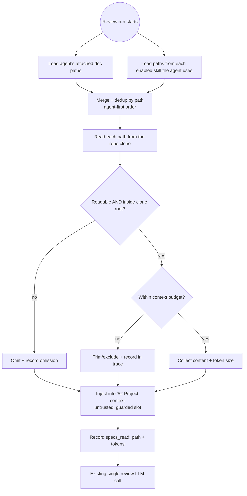
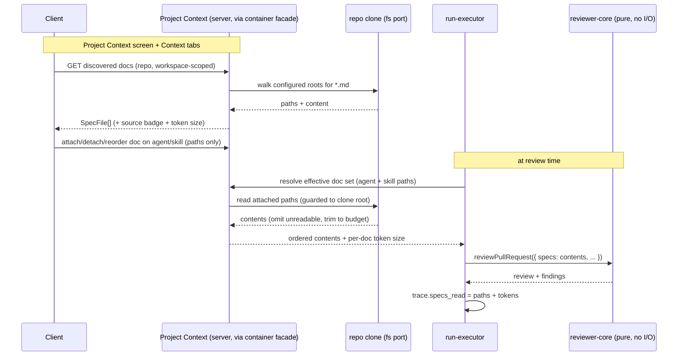

# Spec: Project Context  |  Spec ID: SPEC-08  |  Status: approved
Supersedes: —

## Problem and Purpose
Repositories already carry their own Markdown specifications (`specs/`, `docs/`,
`insights/` folders), but those documents are written "for people" and play no
part in automated review. A reviewer agent has no way to know that, say, "the
`api/` module must not import `db/` directly" is a project invariant — so it
cannot flag a PR that violates it.

**Project Context** lets a user attach repo Markdown to a review agent (or to a
skill the agent uses) so that during a run those documents are injected into the
prompt as authoritative project context. The specification stops being a passive
document and starts guiding the reviewer.

This is the first of two specification-in-the-loop features; it is intentionally
small and demonstrates the value of having the spec drive the review.

## Goals / Non-goals
- Goal: discover all repo Markdown under the configured root folders (`specs`,
  `docs`, `insights`) and present them on a Project Context screen with previews.
- Goal: let a user **manually** attach documents to an agent (Context tab) and to
  a skill (Context tab), with a user-controllable attachment **order**.
- Goal: at run time, read the attached documents from the clone and inject them
  into the existing `## Project context` prompt slot as an untrusted block.
- Goal: make the injection **verifiable** — the run trace lists which documents
  were embedded and their size in tokens.
- Goal: agents inherit the documents attached to any skill they use, merged with
  their own attached documents (effective context).
- Non-goal: **auto-selection** of documents for a specific PR (the "flash
  selector"). Manual selection only — auto-selection is explicitly future work.
- Non-goal: embedding document **text** in the agent/skill metadata or in the
  saved prompt template. We store **paths** only; text is read at run time.
- Non-goal: editing the repo's Markdown from DevDigest writing back anywhere. The
  Project Context screen's Preview/Edit toggle is **preview/read-only** in this
  feature — DevDigest does not persist edits to the clone or to any overlay.
- Non-goal: introducing any new LLM call. This feature is zero-model-cost.
- Non-goal: semantic chunking / embedding of these docs for retrieval. The
  footer's "chunks" counter reflects the **existing repo-intel index**, not a new
  index built by this feature.

## User stories
- As a reviewer-operator, I want to browse my repo's spec/doc Markdown in one
  place so I can decide which documents a review agent should treat as rules.
- As a reviewer-operator, I want to attach specific documents to an agent and
  control their order, so the most important invariants appear first in context.
- As a skill author, I want to attach documents to a skill so every agent using
  that skill inherits the same project context without re-attaching it.
- As a reviewer-operator, I want to see the full effective context (my own docs
  plus skill-inherited docs) before I trigger a run, so injection holds no surprise.
- As a reviewer-operator, I want the run trace to show exactly which documents
  were embedded (and their token cost) so the review is auditable, not a guess.
- As a reviewer-operator, I want a PR that violates a documented invariant to be
  caught by the reviewer citing that document.

## Acceptance criteria (EARS)

### Discovery / reader
- AC-1: WHEN the Project Context screen is opened for a repo, the system **shall**
  return every `.md` file in the repo clone whose path matches the configured
  root-folder glob (default `**/{specs,docs,insights}/**/*.md`, root folder names
  from config), each with its repo-relative path.
- AC-2: The system **shall** present each discovered document with its source-root
  badge (which of `specs` / `docs` / `insights` it was found under), a Markdown
  preview of its content, and an approximate per-document token size.
- AC-3: IF the repo has no clone on disk (never cloned / clone missing), THEN the
  system **shall** return an empty document list with a reason, not an error.
- AC-4: The system **shall** derive the root folder names from configuration; when
  config supplies no roots, it **shall** fall back to the default
  `specs`, `docs`, `insights`.
- AC-24: For each discovered document, the system **shall** show a **usage
  indicator** defined as the **count of agents (in the workspace) whose effective
  context includes that document** — i.e. agents that attach it directly OR inherit
  it through a skill they use. This is the "Used by N agents" figure; the screen's
  "COVERAGE" indicator renders this same usage count (e.g. as N-of-total agents).
  The count is derived deterministically from current attachments — no model call.

### Manual attach (agent + skill)
- AC-5: The system **shall** let a user attach or detach a discovered document to
  an agent, storing the document **path** (not its text) in the agent's metadata.
- AC-6: The system **shall** let a user attach or detach a discovered document to
  a skill, storing the document **path** (not its text) in the skill's metadata.
- AC-7: WHEN a user reorders attached documents (drag), the system **shall**
  persist the new order, and that order **shall** determine assembly order at run
  time (earlier attachment → earlier in the `## Project context` block).
- AC-8: WHILE the Context tab is open, the system **shall** show a running
  estimate of the total token size of the currently-attached documents.
- AC-9: WHERE a document path was attached but no longer exists in the clone (file
  deleted/renamed), the system **shall** surface it as missing in the editor and
  **shall** skip it at run time rather than fail the run (see AC-14).

### Run-time injection
- AC-10: WHEN a review run executes, the system **shall** compute the effective
  document set = the agent's own attached documents PLUS the documents attached to
  each enabled skill the agent uses, read those files from the clone, and inject
  their contents into the `## Project context` prompt slot.
- AC-11: The system **shall** de-duplicate the effective set by repo-relative path
  so an identical path attached at both agent and skill level is injected **once**;
  the surviving order **shall** be the agent's own attached documents first (in
  their stored order), then skill-inherited documents not already included (in
  skill order, then per-skill attachment order).
- AC-12: The system **shall** inject the documents as an **untrusted** block —
  reusing the existing `## Project context` slot, its delimiter wrapping and the
  injection guard from L02–L04 — and **shall not** treat document contents as
  instructions.
- AC-13: The system **shall** introduce **zero** new LLM calls; document injection
  is a deterministic file read.
- AC-14: IF an attached document cannot be read at run time (missing/renamed file,
  read error), THEN the system **shall** omit that document, continue the run with
  the remaining documents, and record the omission — it **shall not** fail the run.
- AC-15: WHERE an agent has repo-intel / context enrichment disabled, the system
  **shall** still inject its attached Project Context documents — Project Context
  injection is **independent of the repo-intel toggle** (decided). Repo skeleton
  and callers may be suppressed by that toggle; attached documents are not.

### Observability
- AC-16: WHEN a run embeds Project Context documents, the run trace **shall** list
  each embedded document's repo-relative path under "Specs read".
- AC-17: WHEN a run embeds Project Context documents, the run trace **shall**
  record each embedded document's size **in tokens**, so the embedded context is
  verifiable and not a guess.
- AC-18: The run trace's "Prompt assembly" section **shall** expose the assembled
  `## Project context` block as a labeled, untrusted block alongside the existing
  System / Skills / Repo skeleton / Callers / Diff blocks.

### Reproducibility, budget, effective-context preview, tenancy
- AC-19: WHEN an agent's configuration is versioned/snapshotted, the system
  **shall** capture the agent's ordered attached document **paths** as part of that
  version snapshot, so an eval replay of a past agent version injects the same
  document set (reproducible runs), not whatever is attached at replay time.
- AC-20: IF the effective document set would make the assembled review prompt
  exceed the model's usable context window, THEN the system **shall** degrade
  rather than fail the run, using this policy (decided): the `## Project context`
  slot is allotted a **server-side budget** (a configurable share of the model's
  usable context window, after reserving room for the system prompt, skills, repo
  intel, and diff). Documents are admitted in **assembly order (AC-11)** until the
  budget is reached; the document that crosses the boundary is **truncated** to fit
  and every excluded or truncated document is **recorded in the trace**. Whole
  documents are preferred to partial ones where both fit. This makes AC-14's "never
  fail the run" guarantee hold even for oversized context. The running editor
  estimate (AC-8) is the soft, pre-run warning of this same budget.
- AC-21: The system **shall** derive the editor's running token estimate (AC-8),
  the per-document size shown during browsing (AC-2), and the trace's per-document
  token size (AC-17) from the **same** token-counting authority, so the figure the
  user sees matches the figure recorded for the run (no client/server divergence).
- AC-22: WHEN a user views an agent's Context tab, the system **shall** present a
  read-only **effective-context preview** — the deduped, ordered union (per AC-11)
  of the agent's own documents and the documents inherited from the skills it uses
  — so the user can verify what will be injected before triggering a run.
- AC-23: The system **shall** scope document discovery and attachment to the
  workspace that owns the repo / agent / skill, consistent with the project's
  multi-tenancy guard — no cross-workspace document access.

## Edge cases
- Repo with no `specs`/`docs`/`insights` folders → empty document list, no error.
- A document attached at both the agent and a skill → injected once (AC-11).
- The same path discovered under two roots is impossible (path is unique), but a
  doc whose folder name matches a root at multiple depths (e.g. `a/docs/b/docs/x.md`)
  is matched by the recursive glob and listed once by its full path.
- Attached document later deleted/renamed in the repo → shown as missing in the
  editor (AC-9), skipped at run time (AC-14).
- **Clone updated between attach and run** (a background poll re-clones/updates the
  repo): a still-present path whose *content* changed is injected with its current
  content; the trace records the path that was actually read. Treated as expected
  behavior (context tracks the live clone), not an error — stated so it is a
  decision, not an oversight.
- Very large attached document (e.g. a multi-thousand-line PRD) → still injected,
  subject to the budget degradation in AC-20 (truncated to fit if it crosses the
  budget boundary); the running token estimate (AC-8) warns the user beforehand.
- Many attached documents whose combined size overflows the context window →
  degrade per AC-20 (include up to budget, record the rest in the trace), never a
  failed run.
- Zero documents attached → `## Project context` slot omitted exactly as today
  (no behavior change vs current empty-specs path).
- Binary or non-UTF8 file slipping past the `.md` filter → treated as unreadable;
  omitted (AC-14).
- Symlink inside the clone pointing outside it → must not escape the clone root
  (path-traversal guard; see Untrusted inputs).
- Symlink **cycle** entirely inside the clone → the discovery walk must not loop
  forever (no symlink-following / cycle-safe walk).
- A skill with attached docs is **disabled** before a run → its inherited docs are
  excluded along with the skill itself (effective set follows the enabled-skill
  filter, consistent with how disabled skills are already excluded from the prompt).
- **Concurrent attach/reorder** on the same agent (two tabs) → must not silently
  corrupt the stored order or drop an attachment; last-writer-wins on a full-order
  replace is acceptable only if it cannot leave a partial/duplicated order.

## Non-functional
- **Model-call budget: zero new model calls.** Discovery, attach, and injection
  are pure file/DB operations. The reviewer still makes its existing single
  review call; this feature only changes what is in that call's prompt.
- **Determinism:** for a fixed (clone contents, attachment set, attachment order),
  the assembled `## Project context` block is identical run to run. The dedup +
  ordering rule (AC-11) makes assembly order deterministic.
- **Local-first / degraded mode:** discovery degrades to an empty, reasoned list
  when the clone is absent (AC-3); injection degrades by omitting any unreadable
  document (AC-14) and by trimming to budget on overflow (AC-20). A run is never
  failed by Project Context.
- **Security:** document contents are third-party and injected as **untrusted**
  data (AC-12). File access is confined to the repo clone root — no path
  traversal, no symlink escape (see Untrusted inputs). Discovery/attachment are
  workspace-scoped (AC-23).
- **Performance:** discovery is a bounded recursive walk of the clone restricted
  to the configured roots; run-time injection reads only the attached paths, not
  the whole tree. The in-root `.md` count is assumed **small** for the repos this
  targets, so the discovery endpoint returns the **whole** list in one response —
  **no pagination** in this feature (decided). The walk is still cycle-safe and
  skips ignored dirs so a pathological tree cannot blow up the response.

### Module boundaries & ownership (design constraints — WHAT, not HOW)
These are altitude-appropriate boundary requirements surfaced by the design-gap
review; they constrain the design without prescribing code.
- **Filesystem access is server-side only.** Discovery (walking the clone) and the
  run-time read of attached paths happen in the server. `reviewer-core` stays pure
  (no I/O — its `specs` input already accepts *resolved* content strings), so the
  server must resolve and read documents before invoking the review.
- **Filesystem reads go through a port/adapter**, consistent with the project's
  onion/ports-and-adapters convention — the application layer must not perform raw
  filesystem I/O directly.
- **The run-executor reaches Project Context through a container facade**, the same
  way it reaches skills today via the shared container — it must not import the
  Project Context module's internals directly.
- **Three responsibilities are distinct**: (1) discovery (stateless, repo-bound),
  (2) attachment persistence (ordered path links on agents and skills), and (3)
  run-time effective-set resolution (a deterministic, DB-free merge/dedup/order
  function over collected paths). Resolution should be testable in isolation from
  the database and the filesystem.
- **The clone path is provided to the reader, not rediscovered by it** — the reader
  receives the repo's clone path; it does not couple to the repo-intel facade to
  obtain it.

## Inputs (provenance)
- Discovered Markdown files (paths + content) — [deterministic: clone filesystem].
  The repo clone path is `repos.clonePath`
  (`server/src/modules/repo-intel/repository.ts:63,143`); repo-intel already reads
  the clone on this same path.
- Attached document **paths** (agent + skill) — [new: persisted metadata]. Stored
  as ordered path links, mirroring the existing `agent_skills { agent_id,
  skill_id, order }` link table (`server/src/db/schema/agents.ts:51-63`) and its
  `AgentSkillLink` contract (`server/src/vendor/shared/contracts/knowledge.ts:236-241`).
- Versioned agent config snapshot incl. attached doc paths — [new: persisted
  metadata]. Extends the existing snapshot that already captures the agent's
  ordered skill ids (`AgentVersionConfig`,
  `server/src/vendor/shared/contracts/knowledge.ts:248-254`;
  `server/src/db/schema/agents.ts:38-49`).
- Root folder names (`specs`/`docs`/`insights`) — [deterministic: config]. Added
  to the env config alongside `cloneDir` (`server/src/platform/config.ts:46-47,67-69`),
  which today has no context-roots key.
- Token sizes (browsing, editor estimate, trace) — [deterministic: tokenizer]. A
  single token-counting authority on the server backs all three figures (AC-21).
- Effective document set at run time — [deterministic: agent attachments + skill
  attachments], resolved before the run-executor calls `reviewPullRequest`
  (`server/src/modules/reviews/run-executor.ts:191-224`), which already accepts a
  `specs: string[]` field that is currently never populated
  (`reviewer-core/src/review/run.ts:60,134`; `prompt.ts:46-47,94-97,114`).
- Embedded-doc trace entries (paths + token size) — [deterministic: run-executor],
  written through the run-trace builder's `specsRead`
  (`server/src/platform/trace-builder.ts:33,52`; trace contract
  `server/src/vendor/shared/contracts/trace.ts:87`). **Decided:** the `specs_read`
  contract evolves from `z.array(z.string())` to a per-document
  `{ path, tokens }[]` shape so the trace carries both the path and its token size
  (AC-16/AC-17). This is a **breaking change** for any reader of `specs_read` as
  `string[]` and **must** be applied in lock-step across both hand-maintained
  vendor copies of the trace contract.
- **No LLM call** is added by any of the above.

## Untrusted inputs
- **Document contents** (Markdown from the repo clone) are third-party text.
  They are injected into the `## Project context` slot, which is already
  delimiter-wrapped and protected by the `INJECTION_GUARD`
  (`reviewer-core/src/prompt.ts:16-33,94-97,114`). They **shall** be treated as
  DATA, never as instructions — this feature populates that existing guarded slot
  rather than inventing a new guard.
- **Document paths** are user-selected from the discovered set, but the on-disk
  read **shall** be confined to the repo clone root: reject absolute paths, `..`
  traversal, and symlinks that resolve outside the clone (path-traversal guard,
  per the `security` skill's "Path traversal" rule). A stored path that fails this
  guard is treated as unreadable (AC-14).
- **Repo file tree** (folder/file names) is third-party; the recursive glob walk
  must not follow symlinks out of the clone, must be cycle-safe, and must skip the
  usual ignored dirs.

## Verification
- AC-1 → integration test: seed a clone with `.md` files under and outside the
  root folders; assert only in-root `.md` paths are returned (`*.it.test.ts`).
- AC-2 → integration test on the screen's data contract (path + source badge +
  content + token size present); client unit test for badge rendering.
- AC-3 → integration test with no clone path: assert empty list + reason, 200.
- AC-4 → unit test: config with custom roots vs default fallback drives discovery.
- AC-5 / AC-6 → integration tests: attach/detach persists a path link on the
  agent / skill; assert text is NOT stored.
- AC-7 → integration test: reorder persists order; run assembly reflects it.
- AC-8 → client unit test: token estimate updates as documents are toggled.
- AC-9 → integration + client test: a stored path with no matching clone file is
  flagged missing in the editor payload.
- AC-10 → integration test: agent with own docs + a skill with docs → effective
  set is the union, read and injected into the `## Project context` block.
- AC-11 → unit test on the dedup/order resolver: duplicate path across levels
  appears once, agent-first ordering preserved.
- AC-12 → unit/snapshot test on assembled prompt: documents appear inside the
  `<untrusted source="spec-N">` wrapping under `## Project context`.
- AC-13 → assertion that the run makes the same single review call (no extra LLM
  call); model-call count unchanged.
- AC-14 → integration test: an attached-but-deleted file is omitted; the run
  completes with the remaining documents.
- AC-15 → integration test: agent with `repo_intel=false` still injects its
  attached Project Context documents.
- AC-16 / AC-17 → integration test: run trace lists embedded paths AND a per-doc
  token size for each.
- AC-18 → trace contract / client test: the `## Project context` block is present
  and labeled untrusted in the prompt-assembly view.
- AC-19 → integration test: snapshot an agent with attached docs; mutate the live
  attachments; replay the snapshot version and assert the original doc set is used.
- AC-20 → integration test: attach docs whose combined size exceeds a small test
  budget; assert the run completes, the prompt is trimmed in order, and the trace
  records the excluded/truncated docs (no run failure).
- AC-21 → unit test: the editor estimate and the trace size for the same document
  come from one counting path and agree.
- AC-22 → client test: the Context tab renders skill-inherited docs in the
  effective-context preview (read-only), in AC-11 order.
- AC-23 → integration test: a discovery / attach request for a repo/agent in
  another workspace is denied by the tenancy guard.
- AC-24 → integration test: attach a doc to one agent directly and inherit it on
  another via a shared skill; assert the document's usage count is 2 (deduped per
  agent), and 0 for an unattached doc.
- **Live acceptance demo:** attach a spec containing an invariant (e.g. "the
  `api/` module must not import `db/` directly") to the reviewer; open a PR that
  violates it; assert the reviewer produces a finding that cites the document.

## Diagrams

### Run-time injection flow

### Module / service communication

## Resolved decisions
All clarifications from the draft are resolved; none remain open.

- **Same-path dedup ordering** → **agent-first** (AC-11): agent's own attached
  documents first in stored order, then skill-inherited documents not already
  present.
- **Token budget / truncation** → **trim-to-budget, never fail** (AC-20): the
  `## Project context` slot has a configurable server-side budget; documents are
  admitted in assembly order, the boundary-crossing document is truncated to fit,
  and excluded/truncated documents are recorded in the trace. The editor estimate
  (AC-8) is the soft pre-run warning of the same budget.
- **`specs_read` shape** → evolve from `z.array(z.string())` to
  **`{ path, tokens }[]`** (AC-16/AC-17). Breaking change for `string[]` readers;
  applied in lock-step across both hand-maintained vendor copies of the trace
  contract.
- **Repo-intel toggle interaction** → Project Context injection is **independent**
  of the per-agent repo-intel toggle (AC-15).
- **Discovery result size** → in-root `.md` count assumed **small**; the discovery
  endpoint returns the **whole** list, **no pagination** (Performance §).
- **Preview/Edit persistence** → the Preview/Edit toggle is **preview/read-only**;
  DevDigest persists no edits. The footer "chunks" counter is the **existing
  repo-intel index**, not a new index built by this feature (Non-goals §).
- **"Used by N agents" / COVERAGE** → the per-document usage indicator is the
  **count of agents whose effective context includes the document** (direct or
  skill-inherited); COVERAGE renders this same usage count (AC-24).
