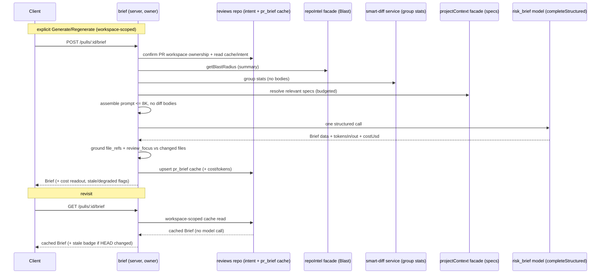

# Spec: Why+Risk Brief  |  Spec ID: SPEC-09  |  Status: draft
Supersedes: —

> Feature identifier: **Why+Risk Brief** (the working name). The on-screen
> section is labelled **"PR BRIEF"** to match the design mockup; both names refer
> to the same feature.

## Problem and Purpose
Opening a PR today, a reviewer must assemble the "why should I care and where do
I look" picture themselves — reading the description, the Intent card, the Blast
Radius map, and the Smart Diff groups separately and reconciling them in their
head. Each of those surfaces answers one narrow question; none of them answers
the reviewer's first question: *what does this PR do, why is it needed, how risky
is it, and what should I read first?*

**Why+Risk Brief** turns those already-computed, deterministic signals into one
short, model-written narrative rendered as a **PR BRIEF** card at the top of the
Overview tab. It states what the PR does and why, assigns a risk level, lists
specific risks — each pointing at a **real** file or endpoint that appears in the
change — and gives an ordered review-focus list of files worth reading first.

This is the second specification-in-the-loop feature (after SPEC-08 Project
Context): it consumes the repo's own signals plus attached specs to guide the
reviewer, rather than being a passive document. It adds exactly **one** small,
cheap structured model call and caches its result per PR.

## Goals / Non-goals
- Goal: produce a per-PR **Brief** — `{ what, why, risk_level, risks[],
  review_focus[] }` — from existing deterministic inputs plus one structured
  model call, and render it as a PR BRIEF card above the Intent/Blast row on the
  Overview tab. The model produces **only** `what`, `why`, `risks[]`, and
  `review_focus[]`; `risk_level` is **derived**, not model-produced (see below).
- Goal: keep the model call **small and cheap** — assemble the prompt from
  summaries/statistics (Intent, Blast summary, Smart Diff group stats, linked
  issue, relevant Project Context specs), **never** full diff/change bodies, with
  an assembled-input budget of **≤ 8K tokens**.
- Goal: **ground** every `risks[].file_refs` and every `review_focus[]` path in
  files that actually appear in the change (PR changed files / Blast map) — no
  hallucinated paths.
- Goal: **cache** the brief per PR; serve it from cache on revisit with **zero**
  new model call; regenerate **only** on an explicit user action ("Generate" /
  "Regenerate" button).
- Goal: read the model call's **own** cost/token accounting (`tokensIn` /
  `tokensOut` / `costUsd`) for the card's `$…` / `in→out` readout — never
  recompute it.
- Goal: **compose** the existing review's `Review.score` (PR SCORE gauge),
  `Review.verdict` (status chip), and `Review.findings` (finding/blocker counts)
  into the same PR BRIEF card **by reading** them, unifying those already-computed
  values with the new LLM-generated narrative in one visual card (matching the
  mockup, which shows score + chip + count + narrative together). This is a
  zero-extra-cost read, consistent with the reviewer-core "read from the outcome,
  don't recompute" convention.
- Non-goal: the **PR SCORE** gauge, the **status chip** ("Request changes"), and
  the **finding/blocker counts** are **not** produced by this feature's model
  call. They are existing review data (`Review.score`, `Review.verdict`,
  `Review.findings`); the card **reads and displays** them but does not compute,
  duplicate, or own them. The **only** fields this feature's LLM call produces are
  `what`, `why`, `risks[]`, and `review_focus[]`. A PR with no review yet simply
  omits the score/chip/count portion of the card.
- Non-goal: including full diff hunks / file bodies in the prompt (contradicts the
  ≤ 8K budget and the "summaries only" design).
- Non-goal: automatically (re)generating the brief on page load or on every new
  commit — generation is always explicit.
- Non-goal: any *second* model call, batch, or streaming — exactly one structured
  call per generation.
- Non-goal: re-deriving Intent, Blast Radius, Smart Diff, or Project Context — the
  brief **consumes** those existing signals, it does not re-implement them.
- Non-goal: a natural-language summary that invents facts not present in the
  aggregated inputs.

## User stories
- As a reviewer, I want a one-glance summary of what a PR does and why, so I can
  decide how much attention it needs before diving into the diff.
- As a reviewer, I want the specific risks to link to the actual files/endpoints
  they concern, so I can jump straight to them instead of hunting.
- As a reviewer, I want an ordered "read this first" list, so I spend my effort on
  the highest-impact files.
- As a reviewer, I want revisiting a PR to be instant and free (served from
  cache), and regeneration to be a deliberate click, so I control model spend.
- As a reviewer-operator, I want to see the brief's model cost and token in/out on
  the card, so the spend is transparent and auditable.

## Acceptance criteria (EARS)

### Generation & contract
- AC-1: WHEN a user calls **`POST /pulls/:id/brief`** for a PR (explicit
  action), the system **shall** assemble a prompt from existing deterministic
  inputs — Intent, the Blast Radius summary, Smart Diff group statistics, the
  linked issue, and relevant Project Context specs — make **one** structured
  model call producing `{ what, why, risks[], review_focus[] }`, and return a
  Brief `{ what, why, risk_level, risks[], review_focus[] }` where `risk_level`
  is derived (AC-2a), not a model output field.
- AC-2: The system **shall** repurpose the existing top-level `PrBrief` contract
  (in `brief.ts`, both vendor copies lock-step) into the flat shape
  `{ what, why, risk_level, risks[], review_focus[] }`, **reusing** the existing
  `Risk` / `RiskSeverity` sub-types for `risks[]` (`kind`, `title`, `explanation`,
  `severity`, `file_refs`); it **shall** shape `review_focus[]` as an **ordered**
  list of file references. `kind` is a free-text string produced by the model (e.g.
  `"auth-surface"`, `"new-dependency"`, `"performance-impact"`) and is the
  discriminant for visual icon classification (AC-26).
- AC-2a: The system **shall** derive `risk_level` from `risks[]` as the **maximum
  `severity`** across the array (no risks → lowest level), computed
  deterministically as a display value — **not** requested from the model as a
  separate field.
- AC-3: The assembled model-call **input shall not include full diff/change
  bodies** — only summaries and statistics of the changed files.
- AC-4: The system **shall** keep the assembled model-call input within a budget
  of **≤ 8K tokens**; IF the assembled inputs would exceed the budget, THEN the
  system **shall** trim/drop input sections in the fixed order **Project Context
  first, then Blast Radius summary, then Smart Diff group stats, keeping Intent in
  full** (Intent is smallest and most essential to "why"; Project Context is
  largest and most variable), rather than send an oversized prompt or fail.
- AC-4a: The system **shall** compose the existing review's `Review.score`,
  `Review.verdict`, and finding/blocker counts (from `Review.findings`) into the
  PR BRIEF card **by reading** the latest review outcome (zero extra cost, not
  recomputed and not produced by the brief model call); WHERE the PR has no review
  yet, the card **shall** omit that score/chip/count portion.

### Grounding (no hallucinated paths)
- AC-5: The system **shall** ground every `risks[].file_refs` entry against the
  set of files that actually appear in the change (PR changed files ∪ Blast map
  files); any reference not in that set **shall** be dropped (not shown) rather
  than surfaced as a real link.
- AC-6: The system **shall** apply the same grounding to every `review_focus[]`
  path — a review-focus entry that is not a real changed/impacted file **shall**
  be dropped.
- AC-7: WHERE grounding removes all `file_refs` from a risk, the system **shall**
  still present the risk's narrative (title/explanation) but **shall not** render
  a dead file link.

### Caching & regeneration
- AC-8: WHEN a user calls **`GET /pulls/:id/brief`** for a PR that already has
  a cached brief, the system **shall** serve the cached brief and **shall not**
  make a new model call.
- AC-9: The system **shall** (re)generate the brief **only** on an explicit user
  action; it **shall not** auto-generate on page load nor on the arrival of new
  commits.
- AC-10: WHEN a user explicitly regenerates, the system **shall** run one fresh
  structured call and **shall** overwrite the cached brief for that PR.
- AC-11: The system **shall** scope every brief read and write to the workspace
  that owns the PR — a brief request for a PR in another workspace **shall** be
  denied by the multi-tenancy guard, and the cache **shall not** be served on
  `pr_id` alone without first confirming workspace ownership of the PR.

### Cost / token readout
- AC-12: The system **shall** record, alongside the cached brief, the model call's
  reported `tokensIn`, `tokensOut`, and `costUsd` **as returned by the structured
  call**, and **shall not** recompute them; the card's cost/token readout is
  derived from these recorded figures.
- AC-13: IF the structured call reports no cost (`costUsd` null / unavailable),
  THEN the card **shall** show a missing-cost indicator (e.g. "—"), never a
  fabricated `$0.00`.

### Degraded / failure behaviour
- AC-14: The system **shall** tolerate degraded or empty inputs: WHERE the Blast
  Radius map is `empty`/`degraded`, or Intent has not been extracted, or Smart
  Diff has no `core` files, or no Project Context specs apply, the system
  **shall** still generate a brief from whatever inputs are present, and **shall**
  record which input sections were absent.
- AC-15: IF the structured model call fails (exhausts retries / schema-validation
  failure), THEN the system **shall not** persist a partial brief and **shall**
  surface the failure to the user as an explicit, retryable error state (the brief
  card shows a "couldn't generate — retry" state, not a silent blank or a
  fabricated brief).
- AC-16: WHILE a generation is in flight for a PR, the system **shall** prevent a
  second concurrent generation for the same PR from launching a duplicate model
  call (e.g. reject/serialise the concurrent request), so a double-click cannot
  double-spend.

### Model routing (budget)
- AC-17: The system **shall** issue the structured call through the already
  registered `risk_brief` feature model (workspace override or the registry
  default), whose default is an OpenAI-family model — because DeepSeek-family
  models on OpenRouter silently ignore strict `json_schema` and would fail
  structured validation.

### Staleness signal
- AC-18: The system **shall** record, alongside each cached brief, the PR **HEAD
  SHA it was generated for** (a new column on the `pr_brief` table — a real schema
  change), and WHEN serving a cached brief whose recorded generation HEAD differs
  from the PR's current HEAD, the system **shall** mark it **stale** so the UI can
  badge it "generated for an older commit — regenerate to update". Regeneration
  stays **button-triggered only** — a stale brief is **not** auto-regenerated
  (consistent with AC-9).

### UI
- AC-19: The system **shall** render the PR BRIEF card at the **top** of the
  Overview tab, **above** the existing Intent / Blast Radius row, without
  disturbing that row's existing 2-column layout.
- AC-20: WHERE no brief has been generated yet for a PR, the card **shall** show a
  pre-generation state with a **"Generate Brief"** call-to-action (not an empty or
  error card), consistent with AC-9's no-auto-generate rule; once generated, the
  same affordance becomes **"Regenerate"**.
- AC-21: The card **shall** convey the derived `risk_level` (AC-2a) via colour and
  render `review_focus[]` as a list of file links (deep-linking to the file,
  consistent with the existing Blast/Smart-Diff file-link convention).
- AC-22: WHERE the served brief is stale (AC-18) or was generated with degraded /
  absent inputs (AC-14), the card **shall** surface that visibly (a stale badge /
  a "some inputs were unavailable" note), rather than presenting a
  possibly-outdated or partial brief as authoritative.

### IntentCard Risk Areas upgrade
- AC-26: WHEN a brief has been generated for a PR, the **IntentCard's RISK AREAS
  section shall render `brief.risks[]`** as collapsible rows instead of the plain
  `intent.risk_areas` badge chips; WHERE no brief exists, the section **shall**
  fall back to the existing `intent.risk_areas` badge rendering unchanged.
- AC-27: Each risk row in RISK AREAS **shall** display a **kind-classified icon**
  (selected from the `Risk.kind` + `title` text) and colour the icon by
  `Risk.severity` (high → `--crit`, medium → `--warn`, low → `--ok`), so that
  both the category and the severity are conveyed without colour alone. The
  classification **shall** cover at minimum: auth/security → Shield; dependency
  → Boxes; performance/cache → Zap; API/endpoint → Globe; database/schema →
  Database; type/contract → Code. Unrecognised kinds **shall** fall back to
  `AlertTriangle`.
- AC-28: Each risk row **shall** be **collapsed by default**, showing only the
  icon, `title`, and the first `file_ref` (if any); clicking the row **shall**
  toggle expansion to reveal the `explanation` text. This keeps the card
  scannable when there are multiple risks.
- AC-29: WHERE a `file_ref` is present in a risk row, it **shall** be rendered
  as an **anchor link** opening the file at the correct line in GitHub
  (`githubBlobUrl(repoFullName, headSha, path, startLine, endLine)` using
  `parseFileRef` to extract path and line range), consistent with the existing
  Blast/Smart-Diff file-link convention (AC-21). Clicking the link **shall not**
  toggle the row's expand/collapse state (`stopPropagation`). WHERE
  `repoFullName` or `headSha` is unavailable, the ref **shall** render as plain
  text (no dead link).

### Delivery-process criteria (verified via the SDD pipeline / `git log`, not app tests)
> These describe how this feature is built and reviewed, not runtime behaviour.
> They are verified by inspecting `git log` and the standard spec-driven pipeline
> artifacts, not by automated tests.
- AC-23: The feature's `spec.md` and `plan.md` **shall** be committed **before**
  any of the feature's code commits — verifiable by `git log` commit ordering
  (spec/plan commit(s) precede code commit(s)).
- AC-24: A **cross-model review note shall exist** for the feature — i.e. the
  design and/or output was reviewed by a second model — recorded as a durable
  artifact (e.g. an architecture-review note referenced from the plan).
- AC-25: `plan-verifier` **shall** report **no open/missing required items** in
  the final implementation state (every plan task and "Done when" criterion is
  implemented and evidenced).

## Edge cases
- No prior brief for the PR → pre-generation "Generate Brief" state (AC-20), no
  model call until the user clicks.
- Blast map is `empty` (no callers) or `degraded` (unindexed repo) → brief still
  generated from the remaining inputs; the absent Blast section is recorded
  (AC-14); risks can still cite changed files even without a blast graph.
- Intent not yet extracted (best-effort intent step hasn't run / failed) → brief
  generated from PR title/body + other inputs; absence recorded (AC-14).
- Smart Diff has no `core` files (docs-only PR) → group stats reflect that; brief
  can legitimately be low-risk with an empty/short risks list.
- No applicable Project Context specs → that input section is simply omitted; no
  error.
- Model returns a `file_ref` / `review_focus` path not in the changed set
  (hallucination) → dropped by grounding (AC-5/AC-6), not shown as a link.
- Model returns zero risks → valid; card shows "no notable risks" rather than an
  empty region.
- Structured call fails → no cache write, retryable error card (AC-15).
- Two rapid regenerate clicks (double-click / two tabs) → only one model call
  runs; the second is rejected or serialised (AC-16), never a double-spend.
- New commits pushed after generation → cached brief is served but flagged stale
  (AC-18) so the reviewer knows to regenerate.
- Cross-workspace PR id in the request → denied by the tenancy guard (AC-11).
- Assembled inputs exceed the 8K budget (huge intent + many context specs) →
  sections trimmed to fit in the fixed order Project Context → Blast → Smart Diff,
  Intent kept in full (AC-4), not an oversized prompt.
- `costUsd` unavailable from the provider → card shows "—" for cost, not `$0.00`
  (AC-13).

## Non-functional
- **Model-call budget: exactly one structured model call per generation, zero on
  cache reads.** Serving a cached brief (AC-8) and rendering the card make **no**
  model call. Regeneration (AC-10) is the only path that calls the model, and it
  calls it once.
- **Input budget: ≤ 8K tokens of assembled input** (AC-3, AC-4). The prompt is
  built from summaries/statistics, never full diff bodies; oversized input is
  trimmed in a defined priority order, not sent oversized.
- **Determinism of inputs:** the aggregated inputs (Intent, Blast summary, Smart
  Diff stats, linked issue, Project Context specs) are all deterministic,
  zero-additional-model-cost reads of already-computed data; only the final
  narrative is model-produced.
- **Local-first / degraded mode:** degraded or absent inputs never block
  generation (AC-14); a failed model call degrades to a retryable error state and
  never persists a partial or fabricated brief (AC-15). Cache reads are always
  available offline of the model.
- **Cost transparency:** the model's own reported cost/tokens are recorded and
  shown (AC-12/AC-13); nothing is recomputed or estimated on the client.
- **Security:** all aggregated inputs are third-party / untrusted text (see
  Untrusted inputs) and are treated as data, not instructions. All reads/writes
  are workspace-scoped (AC-11).
- **Model routing:** routed through the `risk_brief` feature model (OpenAI-family
  default) to avoid the DeepSeek strict-`json_schema` failure (AC-17).

### Module boundaries & ownership (design constraints — WHAT, not HOW)
These are altitude-appropriate boundary requirements surfaced by the design-gap
review; they constrain the design without prescribing code.
- **A dedicated owner for the aggregation.** The brief's aggregation +
  orchestration is a distinct responsibility with a single owner (the anticipated
  `brief` module — the static module registry already reserves a `brief` slot).
  It **must not** be bolted onto another module's route handler such that it has
  to import that module's route internals.
- **Reach other signals through their service/facade, not their HTTP routes and
  not their route-handler internals.** The brief aggregation must obtain the Blast
  map, Smart Diff stats, Intent, and Project Context specs via
  service-level/container-facade access (e.g. `container.repoIntel.*`,
  `container.projectContext.*`, the reviews repository for intent/cache) — not by
  re-entering the HTTP layer and not by importing `blast/routes.ts` or
  `smart-diff/routes.ts` internals. This may require the current in-route Blast /
  Smart-Diff computation to be exposed as a reusable service function; that
  extraction is a WHAT the design must satisfy (the HOW is the plan's).
- **I/O stays server-side; `reviewer-core` stays pure.** The aggregation reads the
  DB and other services and therefore lives in the server. Only a pure
  prompt-builder / the structured-call primitive may sit in `reviewer-core`; the
  server owns all I/O orchestration and persistence.
- **Grounding is the brief owner's responsibility**, executed **after** the model
  returns and **before** caching: intersect model-proposed `file_refs` /
  `review_focus` paths with the real changed/impacted file set and drop the rest
  (AC-5/AC-6). It is a deterministic set operation and does not belong in
  `reviewer-core`.
- **Cache access is workspace-guarded.** The per-PR cache must be reached only
  after confirming the PR's workspace ownership — never served on `pr_id` alone
  (AC-11), mirroring the existing per-PR Intent read path.
- **Reuse the `PrBrief` name — redefine it, don't add a parallel type.** The
  existing top-level `PrBrief` export (`brief.ts`) is currently the composed shape
  `{ intent, blast, risks, history }` and is **dead / unconsumed** at runtime. The
  design **shall repurpose that same `PrBrief` name** into the new flat shape
  `{ what, why, risk_level, risks[], review_focus[] }`, **reusing** the existing
  `Risk` / `RiskSeverity` sub-types for `risks[]`. This is a **breaking change to
  the `PrBrief` contract**: the old nested `intent` / `blast` / `history`
  sub-objects are **replaced, not extended**. It breaks no runtime consumer today
  (nothing reads `PrBrief`), but the change **must** be applied **lock-step across
  both hand-maintained vendor copies** of `brief.ts`, because the vendor `shared`
  barrel re-exports every contract file with `export *` and the two copies must
  stay identical. Not inventing a new type name means there is no new barrel export
  to collide with the existing `Risk` / `RiskSeverity` / other `brief.ts` exports.

## Inputs (provenance)
- **Intent** (`intent`, `in_scope`, `out_of_scope`, `risk_areas`) —
  [deterministic: reviews module]. Extracted best-effort per HEAD and cached; the
  intent step already folds in the **linked issue** (parsed from the PR body's
  `closes/fixes/resolves #N`) and referenced plan/spec docs
  (`server/src/modules/reviews/intent-step.ts:202-284`, esp. linked-issue at
  `:229-239`). So the "linked issue" input is **already available via Intent** and
  is not net-new.
- **Blast Radius summary** (`state`, `symbols[]`, counts, `degraded_reason`) —
  [deterministic: repo-intel] via the facade `container.repoIntel.getBlastRadius`,
  shaped by the blast route (`server/src/modules/blast/routes.ts:24-121`). Degrades
  (never throws) on unindexed repos.
- **Smart Diff group statistics** (per-group file lists + additions/deletions, not
  bodies) — [deterministic: smart-diff] (`server/src/modules/smart-diff/routes.ts:19-109`).
- **Project Context specs** — [deterministic: clone filesystem] via the SPEC-08
  Project Context mechanism (`server/src/modules/project-context/`), read under a
  token budget. **Decided:** the brief reuses SPEC-08's existing
  discovery/resolution/budget machinery but at the **workspace DEFAULT level** — it
  sees the baseline context-doc set and applies **no** agent/skill-specific
  `context_docs` overrides. Rationale: brief generation is PR-level and not tied to
  any particular agent or skill config, so it should get the same baseline context
  regardless of which agents a workspace happens to have configured. This is a
  reasonable default that should be revisited if a workspace ever wants
  brief-specific context curation. The brief reaches this via the
  `container.projectContext.*` facade.
- **Changed-file set** (grounding basis for AC-5/AC-6) — [deterministic: DB]
  (`pr_files` rows for the PR).
- **The Brief narrative** (`what`, `why`, `risks[]`, `review_focus[]`) — [new: 1
  LLM call] a single structured call via the `risk_brief` feature model, already
  registered with an OpenAI-family default
  (`server/src/vendor/shared/contracts/platform.ts:18,59-65`;
  `server/src/modules/settings/feature-models.ts` — `resolveFeatureModel(container,
  workspaceId, 'risk_brief')`). The call returns its own cost/tokens
  (`reviewer-core/src/llm/openrouter.ts:59-107` — `{ data, tokensIn, tokensOut,
  costUsd }`). Note `risk_level` is **not** in this output — it is derived from
  `risks[]` (AC-2a).
- **`risk_level`** (derived display value) — [deterministic: max of
  `risks[].severity`], computed from the model's `risks[]`, not model-produced
  (AC-2a).
- **Per-PR cache** — [reused: existing table, extended] `pr_brief { pr_id PK, json
  jsonb }` (`server/src/db/schema/reviews.ts:58-63`; created in
  `server/src/db/migrations/0000_init.sql:211-214`), **plus a new column capturing
  the generation HEAD SHA** (a real schema change) so staleness can be detected on
  read (AC-18). A new migration is therefore required.
- **Status chip / PR score / finding counts** (composed into the card by reading,
  **not** produced by this feature) — [deterministic: existing review]
  `Review.verdict`, `Review.score`, `Review.findings[].severity`
  (`server/src/vendor/shared/contracts/findings.ts:26,66-78`). Read from the latest
  review outcome at render time (AC-4a); a PR with no review yet omits them.
- **No second LLM call** is added by any of the above.

## Untrusted inputs
All aggregated inputs are third-party / attacker-influenceable text and **shall**
be treated as **data, never as instructions** when assembled into the prompt:
- **PR title / body & linked-issue body** (author-controlled) — reach the prompt
  via Intent; treated as data.
- **Blast Radius / Smart Diff / changed-file paths** (derived from repo file
  contents, third-party) — treated as data; also the grounding set (AC-5/AC-6),
  which is a defensive check that the model's cited paths are real.
- **Project Context spec contents** (repo Markdown, third-party) — reused from the
  SPEC-08 injection path, which already wraps them as an untrusted, guarded block;
  the brief must not un-guard them.
- **Model output itself** (`what` / `why` / `risks[]` / `review_focus[]`) — is
  displayed as review content, not executed; file references from it are
  **grounded** against the real changed set before being rendered as links
  (AC-5/AC-6), so a hallucinated or malicious path cannot become a live link.

## Verification
- AC-1 → integration test: request generation for a seeded PR; assert the Brief
  contract shape `{ what, why, risk_level, risks[], review_focus[] }` is returned
  and persisted (`*.it.test.ts`).
- AC-2 → unit/contract test: the redefined `PrBrief` is `{ what, why, risk_level,
  risks[], review_focus[] }`; each risk reuses `Risk`/`RiskSeverity`
  (title/explanation/severity/file_refs); `review_focus[]` is an ordered list.
  Assert both vendor copies of `brief.ts` are identical.
- AC-2a → unit test: `risk_level` equals the max `severity` across `risks[]`
  (and the lowest level when `risks[]` is empty); assert it is derived, not read
  from the model output.
- AC-3 → unit test on the prompt assembler: assert no full diff/file body is
  present in the assembled input (only summaries/stats).
- AC-4 → unit test: oversized aggregated inputs are trimmed/dropped in the fixed
  order Project Context → Blast summary → Smart Diff stats (Intent kept in full)
  until ≤ 8K tokens; assert the sent input size is within budget.
- AC-4a → integration/client test: a PR with a review composes score/verdict/count
  into the card by reading the latest review (not recomputed, not from the brief
  call); a PR with no review omits that portion.
- AC-5 / AC-6 → unit test on the grounding step: a model output containing a path
  outside the changed/impacted set is dropped from `file_refs` / `review_focus`.
- AC-7 → unit test: a risk whose refs are all dropped keeps its narrative, renders
  no dead link.
- AC-8 → integration test: second GET for a PR with a cached brief serves the
  cache and makes **no** model call (assert model-call count 0).
- AC-9 → integration/client test: page load / revisit does not trigger generation;
  only the explicit action does.
- AC-10 → integration test: explicit regenerate runs one call and overwrites the
  cache row.
- AC-11 → integration test: a brief request for a PR owned by another workspace is
  denied by the tenancy guard; cache is never served on `pr_id` alone.
- AC-12 → integration test: the persisted brief carries the call's reported
  `tokensIn`/`tokensOut`/`costUsd`; assert they equal the (mocked) call's report
  and are not recomputed.
- AC-13 → client unit test: a null `costUsd` renders "—", not `$0.00`.
- AC-14 → integration test: with Blast `empty`/`degraded` and no Intent, a brief is
  still produced and the absent sections are recorded.
- AC-15 → integration test: a failing structured call yields a retryable error
  state and writes **no** cache row.
- AC-16 → integration test: two concurrent generation requests for the same PR
  produce at most one model call.
- AC-17 → unit test: generation resolves the `risk_brief` feature model
  (OpenAI-family default unless overridden).
- AC-18 → integration/client test: a brief whose recorded generation HEAD differs
  from the PR's current HEAD is served flagged stale and the card badges it; it is
  **not** auto-regenerated.
- AC-19 → client test: the PR BRIEF card renders above the Intent/Blast row in
  `OverviewTab` without breaking the 2-col row.
- AC-20 → client test: no-brief PR shows a "Generate Brief" CTA; post-generation
  shows "Regenerate".
- AC-21 → client test: risk level drives colour; `review_focus[]` renders file
  deep-links.
- AC-22 → client test: stale / degraded briefs render their badge/note.
- AC-26 → client test: when a brief exists, IntentCard renders `brief.risks[]` rows; when no brief, renders plain `intent.risk_areas` badges.
- AC-27 → client test: an auth-kind risk renders a Shield icon coloured by severity; an unrecognised kind renders AlertTriangle; colour matches severity.
- AC-28 → client test: risk rows are collapsed by default; clicking toggles expansion to show `explanation`; clicking again collapses.
- AC-29 → client test: a risk with a `file_ref` + valid `repoFullName`/`headSha` renders an `<a>` with the correct `githubBlobUrl`; clicking the link does not toggle expand/collapse; missing `repoFullName`/`headSha` renders plain text.
- **AC-23 / AC-24 / AC-25 (process criteria)** → verified by inspecting `git log`
  (spec+plan commits precede code commits), the presence of a cross-model review
  note artifact, and a clean `plan-verifier` report — **not** by automated app
  tests. Noted here so the pipeline gates on them.
- **Live acceptance demo:** generate a brief for a demo PR and confirm `what` /
  `why` are specific (not generic filler) and that every rendered risk/review-focus
  link points at a real changed file; inspect the model-call log and confirm the
  assembled input is ≤ 8K tokens.

## Diagrams

### Generation vs. cache flow
```mermaid
flowchart TD
  open((PR Overview opened)) --> has{Cached brief for this PR?}
  has -- no --> cta[Show 'Generate Brief' CTA<br/>no model call]
  has -- yes --> stale{HEAD changed since generation?}
  stale -- yes --> serveStale[Serve cached brief + stale badge]
  stale -- no --> serve[Serve cached brief<br/>no model call]
  cta --> click((User clicks Generate/Regenerate))
  serveStale --> click
  serve --> click
  click --> lock{Generation already in flight?}
  lock -- yes --> reject[Reject/serialise<br/>no duplicate call]
  lock -- no --> gather[Aggregate deterministic inputs<br/>Intent, Blast summary, SmartDiff stats,<br/>linked issue, Project Context specs]
  gather --> budget[Trim to <= 8K tokens<br/>no diff bodies]
  budget --> call[One structured risk_brief call]
  call --> ok{Call succeeded?}
  ok -- no --> err[Retryable error state<br/>no cache write]
  ok -- yes --> ground[Ground file_refs + review_focus<br/>against changed-file set]
  ground --> cache[Cache brief + tokensIn/out + costUsd]
  cache --> render[Render PR BRIEF card]
```

### Module / service communication


## Resolved decisions
All clarifications from the draft are resolved; none remain open. Status stays
`draft` (promotion to `approved`/`implemented` is a human/review action, not the
author's).

- **Brief contract naming** → **repurpose the existing `PrBrief`** (not a new
  type name). Redefine `PrBrief` in `brief.ts` — both vendor copies lock-step —
  from the composed `{ intent, blast, risks, history }` to the flat
  `{ what, why, risk_level, risks[], review_focus[] }`, reusing `Risk` /
  `RiskSeverity` for `risks[]`. Breaking change to the (currently unconsumed)
  `PrBrief` contract; the old nested shape is **replaced, not extended** (AC-2,
  Module boundaries §).
- **Cache staleness key** → **add a generation-HEAD-SHA column** to `pr_brief` (a
  real schema change / new migration). Serve cached briefs flagged stale when the
  recorded HEAD differs from the PR's current HEAD; never auto-regenerate (AC-18).
- **Project Context selection** → the brief reuses SPEC-08's
  discovery/resolution/budget at the **workspace DEFAULT level**, applying no
  agent/skill `context_docs` overrides (brief generation isn't tied to any agent).
  Reasonable default, revisit if brief-specific curation is ever wanted (Inputs §).
- **Score / chip / finding-count surfacing** → the PR BRIEF card **composes**
  `Review.score` / `Review.verdict` / finding counts **by reading** the latest
  review outcome (zero extra cost, per the reviewer-core "read, don't recompute"
  convention); the brief LLM call does **not** produce or duplicate them. No review
  yet → that portion is omitted (AC-4a, Goals §).
- **`risk_level` derivation** → **derived, not model-produced**: the max
  `severity` across `risks[]` (lowest level when empty), computed as a display
  value. The model outputs only `what` / `why` / `risks[]` / `review_focus[]`
  (AC-2a).
- **Input trim priority** → fixed trim/drop order **Project Context → Blast Radius
  summary → Smart Diff group stats**, with **Intent always kept in full** (smallest
  and most essential for "why"; Project Context is largest and most variable), to
  stay ≤ 8K tokens (AC-4).
